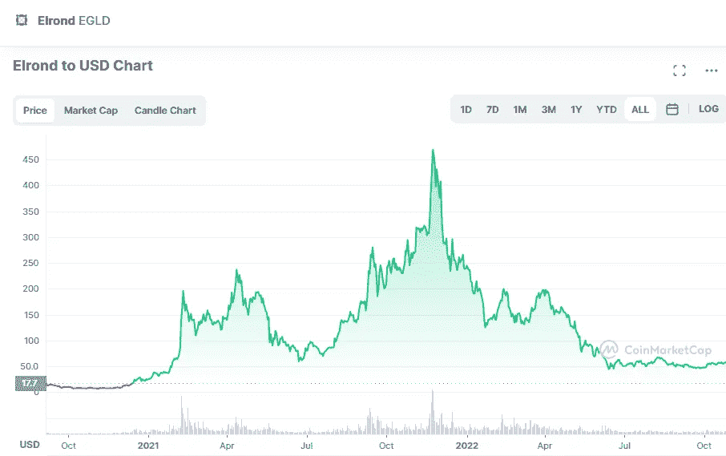

# 埃尔隆德(EGLD)是一个好的投资吗？

> 原文：<https://medium.com/coinmonks/is-elrond-egld-a-good-investment-d03780aa2c04?source=collection_archive---------17----------------------->

Source photo [Elrond price today, EGLD to USD live, marketcap and chart | CoinMarketCap](https://coinmarketcap.com/currencies/elrond-egld/)

埃尔隆德(EGLD)是一个位于区块链的高通量平台，专为未来而设计。目标是让区块链技术更加普及。到目前为止，Lucian 和 Beniamin Mincu 兄弟在 2017 年开发的平台已经产生了许多令人惊叹的功能，使其成为未来几年对潜在投资者具有吸引力的加密货币。