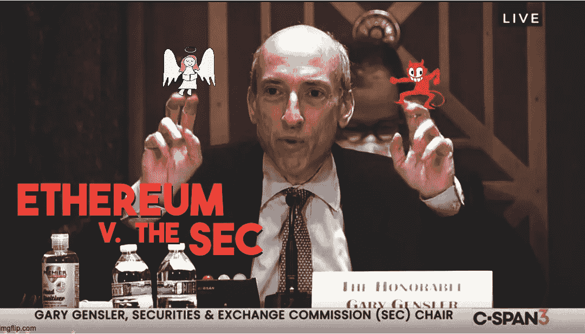

# 以太坊是安全的吗？大概吧。

> 原文：<https://medium.com/coinmonks/is-ethereum-a-security-probably-d11e48922594?source=collection_archive---------5----------------------->

加密推特喜欢诋毁加里·詹斯勒和美国证券交易委员会。证交会是由一个渴望权力的疯子管理的，还是他们只是在遵守法律？

Image: ImgFlip / PixTeller

# 证券法

我想对于大多数加密投资者来说，证券法似乎很愚蠢。它们只是一堆愚蠢的规则，让善良、勤劳的美国人很难在不使用 VPN 的情况下自由投资他们想要的任何东西。