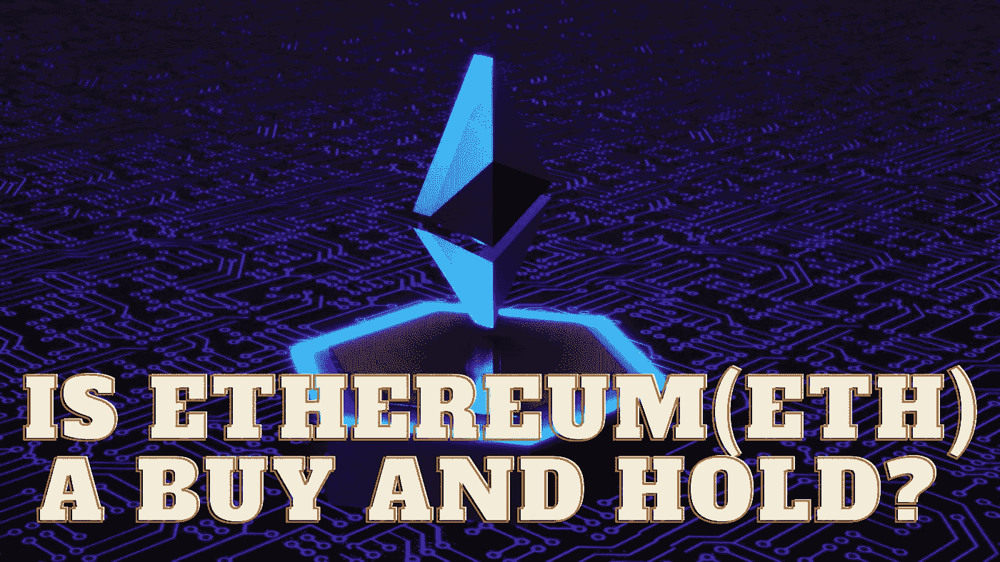

# 以太坊(ETH)是买入并持有吗？

> 原文：<https://medium.com/coinmonks/is-ethereum-eth-a-buy-and-hold-dcee725365e4?source=collection_archive---------42----------------------->

Source photo Unsplash.com

以太坊旨在建立一个全球性的计算平台，支持各种加密货币、DeFi 应用和相当大的分散应用生态系统，而比特币被广泛认为是数字黄金(dApps)。以太坊区块链被许多不同的元宇宙项目使用，包括沙盒、Axie infinite 和 Star Atlas。