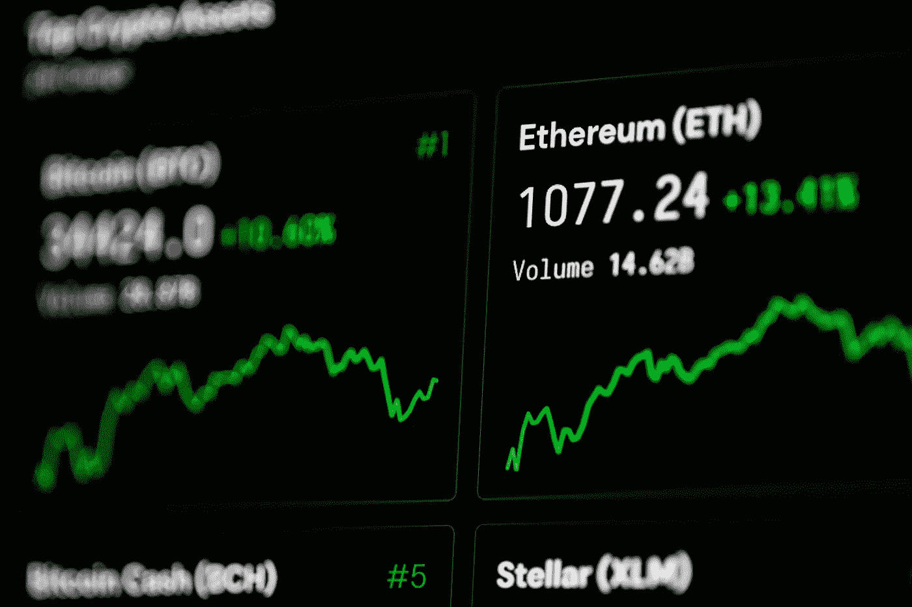

# 以太坊(ETH)是熊市的好投资吗？

> 原文：<https://medium.com/coinmonks/is-ethereum-eth-a-good-investement-in-bear-market-283eedec669d?source=collection_archive---------13----------------------->

Source photo [Close Up Shot of Computer Screen · Free Stock Photo (pexels.com)](https://www.pexels.com/photo/close-up-shot-of-computer-screen-6478886/)

截至 FTX 提交破产申请时，以太坊(CRYPTO: ETH)已从 6 月份的低点上涨了 26%，但此后有所回落。以太坊是一种分散的、成熟的加密货币，与 FTX 没有什么关系，所以在这种情况下，把婴儿和洗澡水一起倒掉可能是一种浪费。

以太坊与加密货币形成鲜明对比，如 FTX 代币和许多…