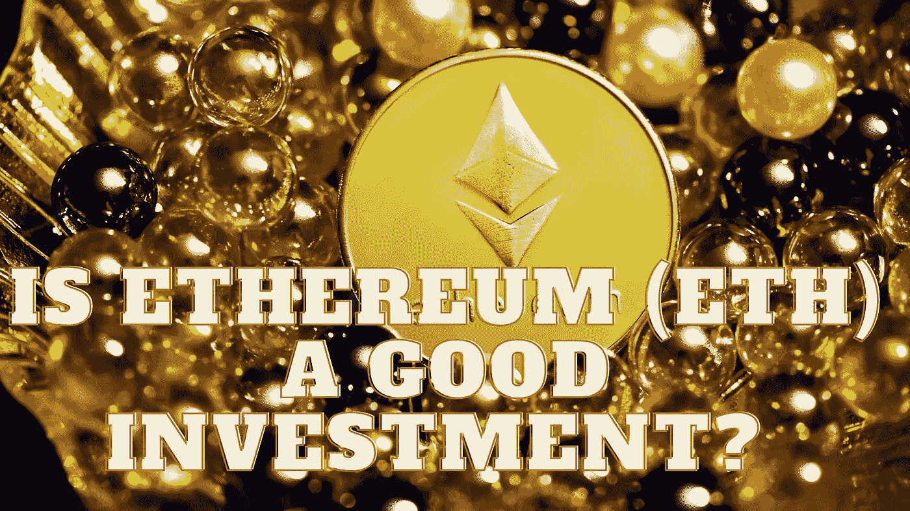

# 以太坊(ETH)是一个好的投资吗？

> 原文：<https://medium.com/coinmonks/is-ethereum-eth-a-good-investment-7548f04a8d0a?source=collection_archive---------41----------------------->

Source photo Unsplash.com

区块链之所以能够经受住 51%的攻击，是因为其分散的所有权吸引了数百名开发人员加入由 Vitalik Buterin 创建的广受欢迎的智能合同网络。

根据 dApps 网站的统计，到目前为止，已经有超过 2962 个应用程序是利用以太坊虚拟机生成的。dApps 是一个跟踪使用各种…