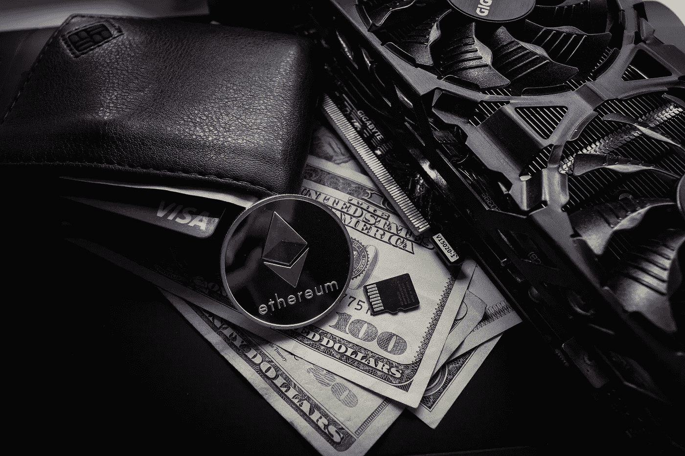

# 2023 年以太坊(ETH)投资好吗？

> 原文：<https://medium.com/coinmonks/is-ethereum-eth-a-good-investment-in-2023-441b7b133361?source=collection_archive---------29----------------------->

Source photo [Leather Wallet Business — Free photo on Pixabay](https://pixabay.com/photos/leather-wallet-business-cards-visa-3080553/)

2023 年，以太坊有望成为最成功的加密货币。说到加密货币的进步，以太坊是最有前途的。与比特币等其他著名的数字货币相比，以太坊主要被用作去中心化应用(dApps)的平台。以太坊为许多不同种类的应用铺平了道路，因为它的智能合约特性，这…