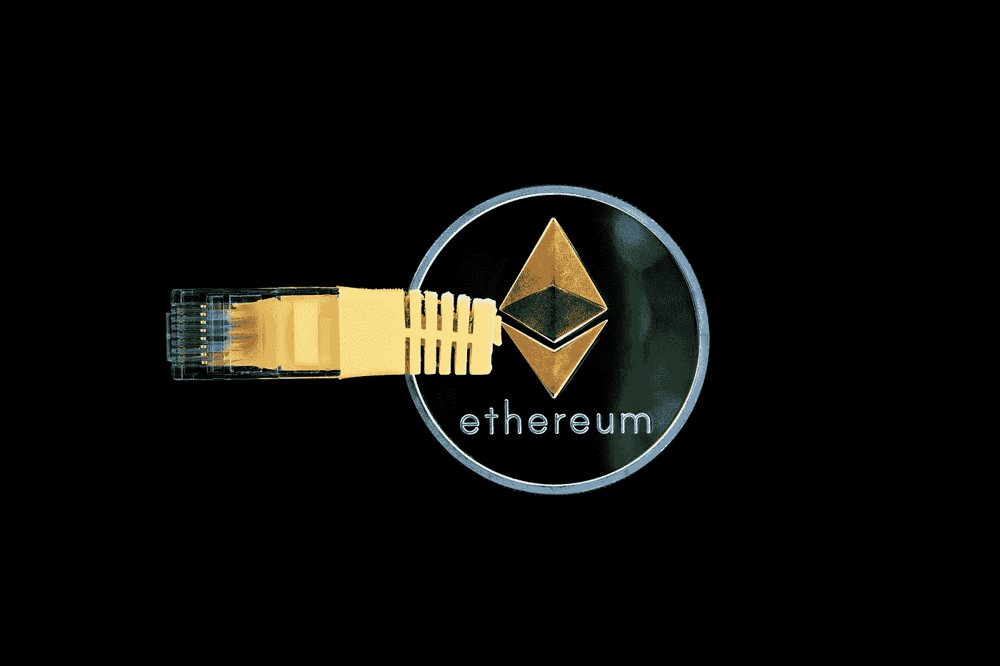

# 以太坊(ETH)是 2023 年必须拥有的加密货币吗？

> 原文：<https://medium.com/coinmonks/is-ethereum-eth-a-must-have-cryptocurrency-your-portfolio-in-2023-141b72b87b54?source=collection_archive---------47----------------------->

Source photo [Criptomonedă Bani Ethereum — Fotografie gratuită pe Pixabay](https://pixabay.com/ro/photos/criptomoned%c4%83-bani-ethereum-digital-3424785/)

无论是从用户兴趣还是资本化程度来看，以太坊都位居第二。与加密货币市场的其他潜在长期投资相比，其 1564.3 亿美元的估值使其成为优秀公司。作为一种加密货币，它的表现一直优于所有其他货币，并一直处于发展的前沿。