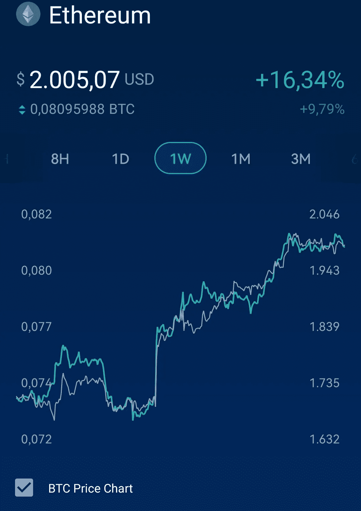

# 以太坊(ETH)比比特币(BTC)更好投资吗？

> 原文：<https://medium.com/coinmonks/is-ethereum-eth-better-investment-than-bitcoin-btc-fef204de2d67?source=collection_archive---------18----------------------->

Source photo Crypto.com App

以太坊(ETH)对比特币(BTC)的表现是 2022 年可能出现替代比特币季节的另一个迹象。以太币对美元的技术分析显示，以太币价格在过去几周一直稳步上升。此外，RSI 可能已经突破了其长期阻力线，并继续其上升趋势，一直到 2100 美元关口。