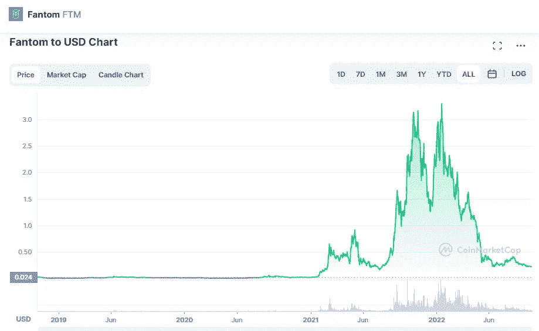

# Fantom (FTM)是一项好的投资吗？

> 原文：<https://medium.com/coinmonks/is-fantom-ftm-a-good-investement-f3f7be81b3a7?source=collection_archive---------23----------------------->

Source photo [Fantom price today, FTM to USD live, marketcap and chart | CoinMarketCap](https://coinmarketcap.com/currencies/fantom/)

在 Fantom 上下注 FTM，Fantom 是领先的第一层区块链之一，允许用户被动地从他们持有的加密货币中产生金钱。为了使用户在 Fantom 上开发和执行以太坊 dApps 成为可能，该网络具有极强的可扩展性和 EVM 兼容性。Fantom 是一个高吞吐量的区块链，它有一个开源的智能契约框架，它以快速和廉价而闻名，因为它是一个…