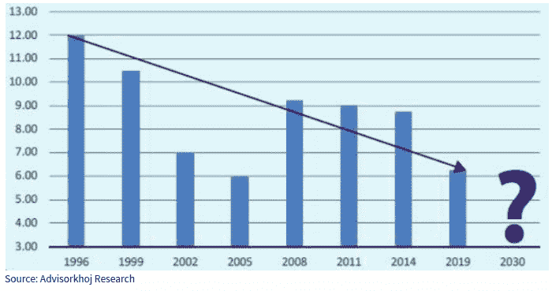
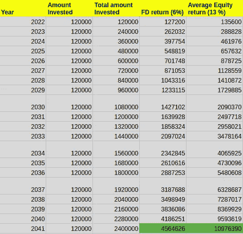
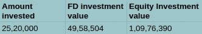
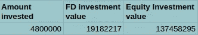
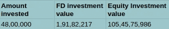
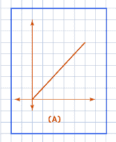
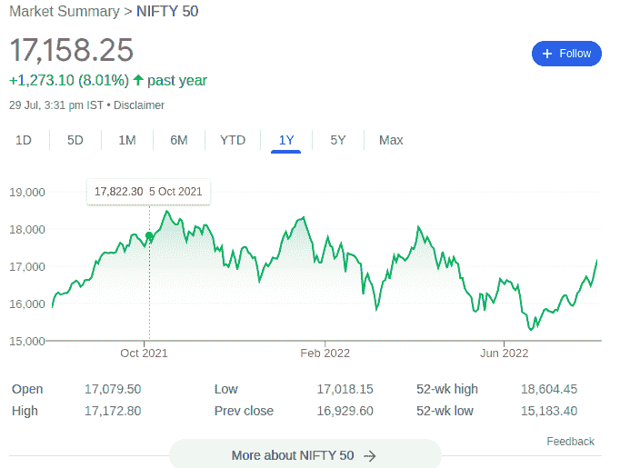
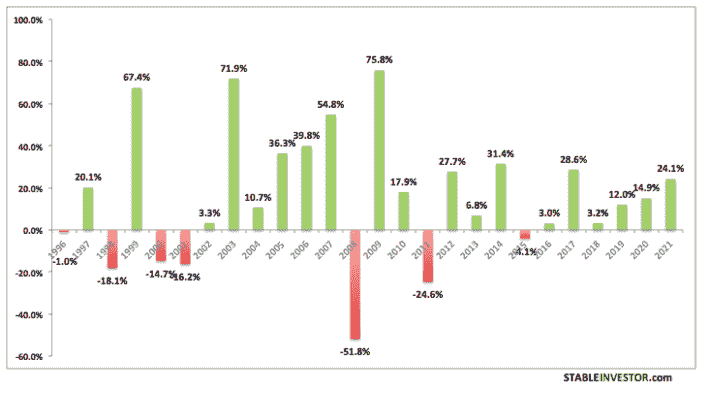
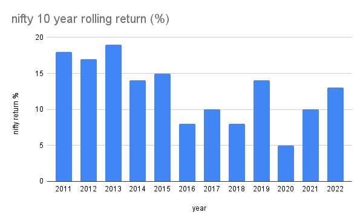

# FD 还是投资的明智选择吗？

> 原文：<https://medium.com/coinmonks/is-fd-still-a-wise-choice-of-investment-fc8a9aba2c7b?source=collection_archive---------14----------------------->

在印度，FD(定期存款)被认为是最安全和最常见的投资方式。根据 2019 年 SEBI 的一项调查，95%的印度家庭倾向于银行 FDs，不到 10%的家庭倾向于共同基金和股票。

以下是人们喜欢定期存款胜过股票、共同基金和漂亮指数的一些原因。

*   钱可以停放，不用担心回报或市场波动。
*   因为是银行提供的，所以方便可靠，人们信任银行。
*   它提供有保证的回报以及本金的安全性。
*   投资期限从 7 天到 10 年不等。
*   根据 1962 年《所得税法》第 80 C 节，它允许最高 150，000 卢比的减税。但是，不允许提前退出这些 FD。

接下来，让我们检查一段时间内 FDs 的性能

FD returns between 1996–2019

从上面的图表中可以看出，金融衍生产品的回报率随着时间的推移而下降，目前，它低于通货膨胀率，这意味着如果我们投资于金融衍生产品，我们基本上是在赔钱而不是存钱。

让我们比较一下 20 年间 FD 和股权的回报率。

Investment in FD vs Nifty (Equity)

上表是 20 年内每月投资 10，000 卢比的情景。为便于计算和表述，将其定为每年 1，20，000 卢比。由于为了方便起见，利息是按年而不是按月计算的，所以实际数字可能会有一些波动

每月投资于利率为 6%的 FDs 的最终价值为 10，000 卢比(当前利率为 5–6%)，而每月投资于股票的最终价值为 10，000 卢比，平均年回报率为 13%，20 年内每年复利。

**到达值背后的简化数学**

复利仅仅意味着利息不仅是从原始本金中获得的，而且是从先前获得的所有利息中获得的。例如，在第一年年末，你的金额将是 1，20，000+15，600(1，20，000 的 15%利息)= 1，35，600。第二年，你会得到(135600+120000)+33228(135600 的 15%利息)= 288828。

现在，我们已经了解了复利和投资股票的力量，我们现在将进行更多的实验，看看时间因素与复利的力量相结合如何能够在一段时间内创造大量的财富。

让我们从上表中提取出我们投资的最终价值，并了解我们如何用时间和复利来进一步增加回报。

Final value of the Investment after 20 years

这是 FD 的 2.2 倍以上的回报率。但 2.2 倍的回报是否超过了市场波动的风险？

让我们把 20 年的投资期限延长到 40 年。让我们观察一下，如果你继续投资 10，000 卢比 40 年，你的投资会发生什么。

Final value of the Investment after 40 years

40 年后，我们投资的价值将为 13，74，58，295 卢比。这是 FD 的 7 倍。我只是考虑了 nifty 的 13%的最低回报率。2002 年至 2012 年间，Nifty 的平均年回报率为 14%，而从 2012 年至 2022 年，平均年回报率为 18%。

Final value of the Investment after 40 years

如果回报率为 18%，40 年后最终投资的价值将为 105，45，75，986 英镑，比定期存款高出 55 倍。

**股权投资为什么有风险，如何降低风险？**

下面是 1 年的 FD 回报图和 1 年的 nifty 回报图的对比。

A sample linear graph which represents return of FD for 1 year

Nifty return graph for 1 year (Extracted from google)

看起来 FD 图表是一致的，而漂亮的图表本质上是非常不稳定的。在接下来的几分钟里，我们将揭开长期游戏背后的秘密，以及如何通过几乎什么都不做来应对市场的波动。

*Annual return of nifty 50 since 1996–2021*

上图代表了自市场建立以来 nifty 每年的绝对收益。我们可以看到 nifty 全年给出了不同的回报，从 2008 年的-51%到 2009 年的+75%。我们还可以看到每次下跌后大规模回报的模式。每次下跌都是投资的机会，因为市场总是会从每个低点反弹并达到新的高点。

**10 年滚动回报**

10 年期的滚动回报率是通过计算前 10 年的平均回报率得出的。例如，nifty 在 2021 年的 10 年滚动回报率将是 nifty 在 2011 年至 2020 年间的平均回报率。通过这样做，我们可以看到平滑的图表，它代表了 nifty 在 10 年期间的表现。

让我们看看 nifty 在 2011 年至 2022 年的 10 年间的滚动回报

10 year Rolling return of nifty between 2011–2022

这张图表显示，如果我们将资金投入股票市场 10 年，我们保证会有 13%的回报。在过去 20 年中，金融衍生产品的回报率一直在下降，而 Nifty 的回报率一直保持在平均 13-15%的水平。

既然我们已经看到了金融衍生工具和股票之间的回报和风险差异，让我们对股票、nifty 和股票以及投资于股票/nifty 等术语的含义有一个基本的了解。

**股权、俏皮、股票等。，它们是什么？**

Nifty 50 指数是一个代表市值最大的 50 家公司的指数。公司的权益是其扣除负债(债务)后的总价值。当一家公司注册上市时，他们将其总价值分成 n 股，每股都有一个特定的价格。投资股票就是通过在股票市场购买一家或多家公司的一股或多股股票来投资一家公司。

除了股票比金融衍生工具提供的多倍回报之外，让我们来看看其他一些优势。

投资股票是避免通货膨胀和金融衍生产品收益递减的方法。

*   当出现通货膨胀(商品或原材料价格上涨)时，企业会将其转嫁给消费者。我们，顾客，将会支付高价。一旦原材料价格下降，商家就不会把价格降到正常水平。相反，他们保留利润。如果我们投资于这些企业，而不是投资于银行，我们就可以利用通胀为自己谋利。因为公司在股东之间分享利润。
*   此外，每当出现经济危机时，政府就会减少 FD 和其他政府计划的回报，从而拿走我们的钱。同样，摆脱这一障碍的方法是投资于企业，因为政府不会让企业倒闭，企业也不会让投资者倒闭。

**结论:**

如果你是长期投资，最好投资股票而不是金融衍生产品，因为投资的风险接近于零，而且在同一时期，股票比金融衍生产品提供多倍的回报。对于短期投资(1-5 年)，你可以选择 PPF、短期国库券、债券基金等，而不是金融衍生工具，以获得更安全和更好的回报。

后续文章将详细讨论财务发展的替代方案、股权和非股权投资的类型，以及如何投资。

> 交易新手？在[最佳加密交易](/coinmonks/crypto-exchange-dd2f9d6f3769)上尝试[加密交易机器人](/coinmonks/crypto-trading-bot-c2ffce8acb2a)或[复制交易](/coinmonks/top-10-crypto-copy-trading-platforms-for-beginners-d0c37c7d698c)