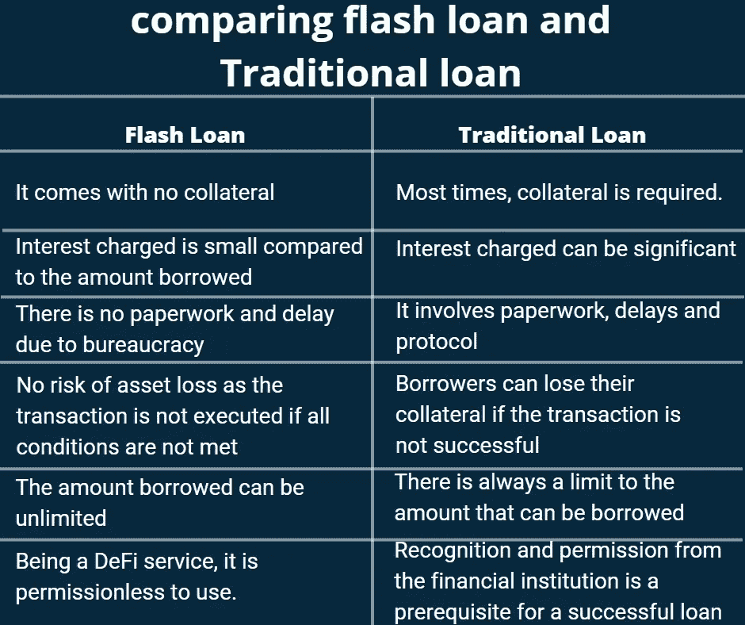

# 闪贷值得承受压力吗？

> 原文：<https://medium.com/coinmonks/is-flash-loan-worth-the-stress-28e56645702a?source=collection_archive---------9----------------------->

您可能在智能合约中遇到过一两种攻击类型，但如果没有，也不用担心。你可以在这里找到对智能合约的各种攻击。你也可以看我[之前对三明治攻击 1](https://www.smartcontractresearch.org/t/research-summary-analyzing-and-preventing-sandwich-attacks-in-ethereum/1033/23) 的评论——一种智能契约攻击。

像其他智能合同攻击一样，当一些 DeFi 用户利用一个无害的功能时，就会出现闪贷攻击。坏人利用漏洞来损害用户、生态系统和无害的功能。

在闪贷攻击中，DeFi 用户在没有抵押品的情况下借入大量资金。该基金将在短期内收回，并且只需向借款流动性池支付很少的利息。在这篇文章中，我将比较闪贷和传统贷款，强调闪贷的重要性。通过这种方式，我们可以了解快速贷款是否真的值得让 DeFi 用户承受压力。

## **为什么首先是闪贷？**

大多数 DeFi 产品都是传统金融(TradFi)的改进。闪贷是这些产品的一部分。

在此之前，在传统金融中，借贷需要一系列步骤，在金融机构释放资金之前必须经过检查。

在 TradFi，你必须先获得资格，然后才能贷款。这与闪贷不同，闪贷只需要一台电脑、一个互联网连接和电脑上必要的分散式应用程序(DApps)。

TradFi 鼓励使用抵押品，这限制了获得贷款的容易程度和可获得的金额。

## **传统贷款与 flash 的比较**

如果以表格的形式呈现，会更好理解。因此，我附上了一个表格，比较这两种方法获得贷款。

*图片:闪贷与传统贷款的对比*

**闪贷相对于传统贷款的目标最终实现了吗？**
闪贷支持 DeFi 更大的目标，即通过切断第三方服务，让用户获得资金。DeFi 还旨在在这样做的同时保护用户的资金。

尽管 DeFi 的安全性值得怀疑，但它在提供可访问性和去中心化方面做得很好。本质上，闪贷的目标部分实现了，因为闪贷存在安全问题。

## **创建新挑战**

贷款的目标是借入资金，进行一些交易/业务，获得一些利润，偿还资本，并将利润装入口袋。传统贷款实现这一点几乎没有挑战，但闪贷的情况是不同的。

在利用快速贷款获利的过程中，机会是无限的，因此用户倾向于利用这一弱点。在他们的[研究论文 2](https://www.smartcontractresearch.org/t/mitigations-against-flash-loan-enabled-attacks/615) 、[、 **@lnrdpss** 、](https://www.smartcontractresearch.org/u/lnrdpss)中列举了这样的弱点:

1.  “泵送和套利(人为抬高资产价格，然后利用由此产生的差价)。
2.  Oracle 价格操纵(降低资产价格，然后打折购买)。
3.  洗盘交易
4.  治理接管(攻击者使用快速贷款买断目标协议的治理)。"

这些问题在 TradFi 中是不存在的。这是闪贷带来的一个挑战，使其目标部分实现。

总之，每一项新技术都有其弱点。研发的目标是帮助新技术变得更好。由 [**@lnrdpss**](https://www.smartcontractresearch.org/u/lnrdpss) 撰写的这篇论文通过提供解决启用闪贷的攻击的[解决方案来证实这一说法。](https://www.smartcontractresearch.org/t/mitigations-against-flash-loan-enabled-attacks/615)最后，快速贷款体现了许多好处，值得强调。

> 交易新手？尝试[加密交易机器人](/coinmonks/crypto-trading-bot-c2ffce8acb2a)或[复制交易](/coinmonks/top-10-crypto-copy-trading-platforms-for-beginners-d0c37c7d698c)