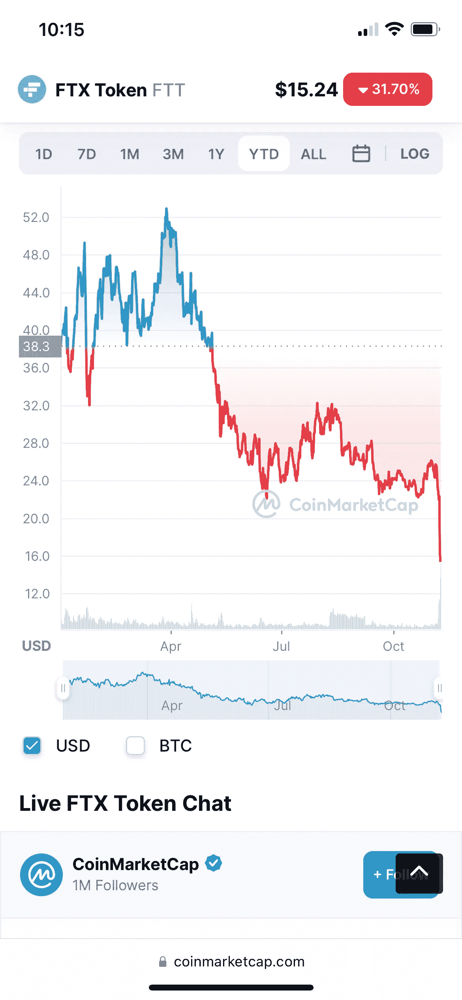

# FTX 的衰落对加密有利吗？

> 原文：<https://medium.com/coinmonks/is-ftx-going-down-good-for-crypto-b4a0c10ad6c8?source=collection_archive---------18----------------------->

# 币安和 FTX 如何描绘同一个密码世界的两个版本

SBF 的萨姆·班克曼·弗里德通过运营加密基金阿拉米达研究公司和推出加密交易平台 FTX 赚了一大笔钱。他因拯救失宠的加密公司而闻名，例如向 Voyager Digital Ltd 贷款 4 . 85 亿美元，收购 BlockFi 亿美元。

他曾被誉为加密技术的救星，但最近却因主张对向美国散户投资者提供投资产品的加密平台实施更严格的《KYC 反洗钱法案》而玷污了自己在加密自由派中的声誉。后者被视为自私之举，旨在更好地巩固 FTX 在美国的地位。

反对意见很快就出现了，尤其是来自另一位加密亿万富翁 CZ，币安首席执行官赵昌鹏。币安总是错在监管较少的一方，这显然阻碍了其全面进入美国。现在，FTX-SBF 在华盛顿的游说很有可能导致币安成为附带损害。

为了发泄他的雇佣，或者仅仅是为了进行合理的风险管理，CZ 公开披露他正在抛售 FTT 的股份，大约 5 亿美元，这是币安出售 FTX 的部分付款。考虑到 FTT 20 亿美元的股票市值，这次抛售造成了 50%的大幅下跌。

美国东部时间 2022 年 11 月 8 日 10.16

由于对 SBF 和他的相关组织的信任已经动摇，转储演变成对 FTX/阿拉米达的运行。不仅 FTT 股市像石头一样下跌，FTX 的撤资也在加速，这有可能造成平台层面的流动性短缺。每个人都在看。

有哪些教训？

*   事后看来，FTX 投入了大量资金，试图拯救倒闭的加密公司。在“隐秘的冬天”,他们还继续为生态系统提供资金，从而进一步消耗了他们的流动性。
*   考虑到围绕 FTX 金融稳定的大量猜测，这种实体的资产和负债显然缺乏披露，即使 SBF 说“FTX 很好”。资产是好的”，或者道权说“稳定的小伙子”…它不削减它。
*   监管者可能对他们的观点感到欣慰，即 crypto 无法自我监管，他们实施更严格的披露框架是正确的。当你呼吁所罗门王作出判断时，他最终会将尸体一分为二。结果很少是好的。
*   Crypto 卓越的透明度目前只是一个承诺。尽管围绕区块链 DLT 的讨论沸沸扬扬，代码也可供所有人阅读，但可悲的现实是，重组任何实体资产负债表的清晰图像仍然是一个巨大的地址难题。
*   没有人会从 FTX-SBF 这样的密码巨头的垮台中受益。最有可能的是，这将对所有加密估值产生可怕的副作用。

在这个漫长的冬季，随着积雪的继续沉降，保持偿付能力，不要下注超过你能承受的损失，保持流动性，坚持深度相关市场的可交易头寸。

**关于—**

*360 Advisory LLC 是一家总部位于波士顿的 RIA 公司，管理投资，包括加密*

👉[上午 9 点至 30 点](https://twitter.com/930AM2)🐰🕳

来源

👉[https://www . Bloomberg . com/news/articles/2022-06-18/bank man-fried-s-alameda-lends-4.85 亿给 crypto-s-voyager](https://www.bloomberg.com/news/articles/2022-06-18/bankman-fried-s-alameda-lends-485-million-to-crypto-s-voyager)

👉[https://www . ftx policy . com/posts/possible-digital-asset-industry-standards](https://www.ftxpolicy.com/posts/possible-digital-asset-industry-standards)

👉https://Twitter . com/miles Deutscher/status/1589631447517655040？s = 20 & t = l49BK-7 rvdfa _ nrkv 9 ozg

> 交易新手？尝试[加密交易机器人](/coinmonks/crypto-trading-bot-c2ffce8acb2a)或[复制交易](/coinmonks/top-10-crypto-copy-trading-platforms-for-beginners-d0c37c7d698c)