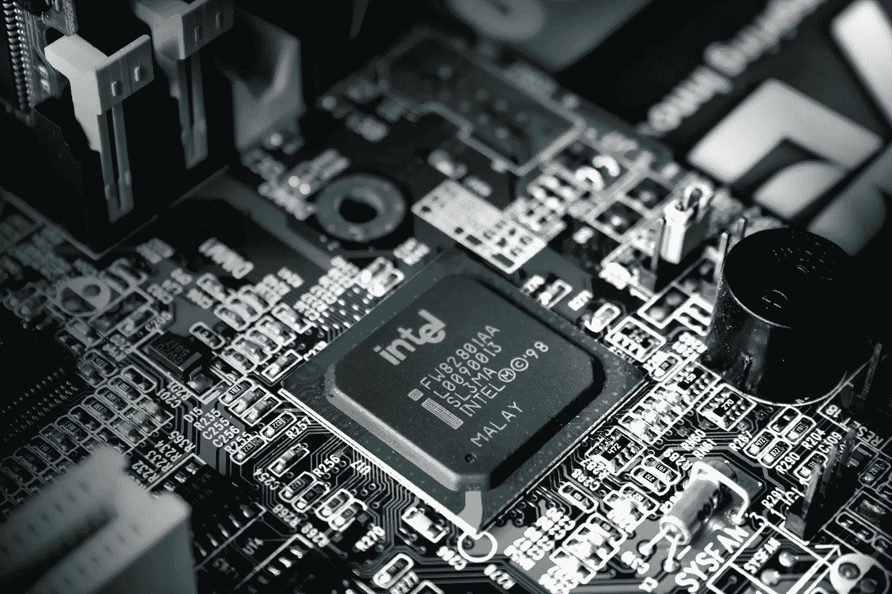

# 英特尔(INTC)的股票是一个好买卖吗？

> 原文：<https://medium.com/coinmonks/is-intel-intc-stock-a-good-buy-ab5172bb243?source=collection_archive---------42----------------------->

Source photo Unspalsh.com

目前，英特尔(纳斯达克股票代码:INTC)是世界上最著名的半导体芯片制造商之一，已经经营了 50 多年。此外，该公司还为包括汽车在内的各种其他设备制造芯片。它可能会在竞争激烈、不断发展的行业中扬名立万。

近年来，英特尔在纳米技术方面取得了巨大进展，这是一门科学…