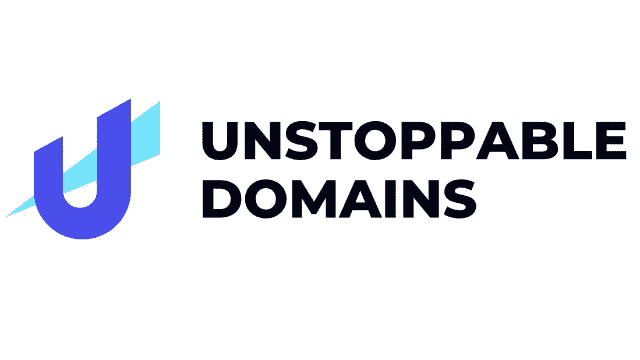

# 投资不可阻挡的领域是明智之举吗？

> 原文：<https://medium.com/coinmonks/is-investing-in-unstoppable-domains-a-smart-move-6380401c335e?source=collection_archive---------16----------------------->

不可阻挡的域名是很多关于它们是否是明智投资的辩论的主题。一些人认为它们只是一个噱头，而另一些人认为它们在未来会更有价值。他们都错了。这是否意味着购买不可阻挡的域名是一个明智的决定？

无法停止的域名是加密货币行业中一个令人兴奋的新选择。很容易将它们作为另一种将被遗忘的“加密热”而一笔勾销，但不要这么快就否定它们的潜在价值。

一次性费用完全拥有和管理你的不可阻挡的域名可能是一个明智的投资，因为 NFT 是安全地在区块链举行。他们也不受审查制度的影响，在一个分散的系统中运作。

> 交易新手？试试[加密交易机器人](/coinmonks/crypto-trading-bot-c2ffce8acb2a)或者[复制交易](/coinmonks/top-10-crypto-copy-trading-platforms-for-beginners-d0c37c7d698c)

由于 NFT 域名是一种新颖独特的服务类型，因此不可能绝对肯定地预测市场在这一时刻的长期反应。

# 互联网的去中心化

Unstoppable Domains 正在将区块链技术的力量整合到一个简单的网络 URL 中。这是基于去中心化和以用户为中心原则的新一波网址，是不可阻挡的域名带给互联网的。因此，它们在为更分散的在线体验奠定基础方面发挥着至关重要的作用，在这种体验中，人们对自己的数据和价值负责。这是通过提供由用户管理和拥有的简单加密钱包和网址来实现的。

# 将资金投入不可阻挡的领域是明智的吗？

几乎没有什么风险涉及购买一个不可阻挡的领域，因为你得到这么多的回报，这样一个小的投资。在一个不可阻挡的领域投资，不会让你陷入一个无法自拔的困境，如果你的投资变得毫无价值的话。

如果你的个人不可阻挡域名是一个非常抢手的 Web3 域名，或者如果你计划在未来使用该域名开发自己的网站，不可阻挡域名是一个很好的投资机会。

# 不可阻挡域的能力到底是什么？

不可阻挡的域名被认为是区块链 NFT 域名的领先供应商。在现实中，你不可阻挡的领域有哪些可能性？使用不可阻挡的域，您可以执行以下操作:

# 轻松支付密码

在发送或接收加密货币时，您通常需要复制并粘贴相关的钱包地址。地址是一大串字母和数字，很难验证。由于不可阻挡的域名，所有你现在必须记住的是你的域名，以便进入你的钱包。

# 分散式网站创建

直到今天，ICANN 仍然保持着对域名系统的完全控制权，并拥有批准或拒绝新域名扩展的唯一权力。域名只能从获得批准的注册商处购买。

不可阻挡的域名的 NFT 域名允许你创建一个分散的网站，只有 NFT 域名的所有者可以访问。如果他们不喜欢你说的话，他们可以从你的网站上删除，甚至接管你的域名。这个系统坏了。分散式网络跳过了 ICANN 和与之相关的所有官僚机构。

一个分散的网站可以很容易地创建不可阻挡的领域。只需点击几下鼠标，你就可以利用他们预先制作的主题创建自己的网站。

你收集的 NFT 甚至可以在一个画廊风格的网站上展示！此外，Unstoppable 打算在不久的将来扩展其当前的功能集以及可用模板的数量。

# 拥有您的在线角色

由于 Web3 的快速发展，个人控制自己的网络自我变得越来越重要。拥有一个不可阻挡的域名是保护你在线身份的好方法，同时也有助于互联网的发展。你还想要什么吗？

# 把你不可阻挡的域名作为 NFT 出售

假设你已经超越了你无法阻挡的领域，想要摆脱它，但是你不知道从哪里开始。由于它以 NFT 的形式在区块链举行，你可以很容易地把你的不可阻挡的域名放在 NFT 市场上出售，在那里其他人很容易就能买到它。

如果你能在比赛前得到任何可能受欢迎的域名，这里可能有赚钱的机会。

# 这款产品有什么特别之处？

# 完全所有权

当你通过不可阻挡的域名而不是典型的域名注册商购买域名时，它是你的。因此，您是您的域名的唯一所有者，并且在任何时候都可以完全控制其销售或转让。

不可阻挡的域名使比特币钱包的所有者能够使用他们的域名进行交易。这项技术用更简单的用户名代替了由字母和数字组成的冗长的公共地址，这些用户名更容易记住，也更不容易出错。例如，如果 abc.crypto 域由 abc 的以太坊地址(0xa0000..)，客户可以向 abc.crypto 付款。

NFT 是 Unstoppable Domains 公司铸造和销售的域名，该公司专门从事域名货币化。他们有一个基础设施，使用户能够使用人类可读的名称而不是代表公钥的相对繁琐的字母数字字符串来交易加密货币。这些名字可以在区块链上找到。由于不可阻挡的域名所做的工作，一个更加分散的网络正在建立。

# 只支付一次

域名无法被无法阻止的域名过滤或控制，这就授予了用户无法控制的域名。不可阻挡的域名购买的是客户的终身域名，而不是租用域名。付费后，域名将长期属于你。它不仅节省了你的时间，而且还免除了你每年支付注册费的负担。

# 抵制审查

不可阻挡的域名可以为激进主义等有争议的内容提供避风港。无论发生什么，不可阻挡的域名将永远不会被封锁或关闭，因为他们固有的区块链技术。此外，除非他们拥有一个不可阻挡的域名网站，否则任何公司、国家或团体都不能以任何方式关闭或破坏它。

# 轻松进行加密货币支付

钱包地址不再是发送和接收加密货币的问题。告诉收件人与电子邮件地址相连的域名就足够了。你不必每次都复制粘贴你的地址，你可以创建一个名为 David.crypto 的域名来纪念你的名和姓。

# 关键要点

不可阻挡的域名是一个迷人的新发展，在不久的将来可能会取代(或至少增加)互联网上的 DNS。

很明显，关于他们还有很多需要发现的。当谈到不可阻挡的域名时，典型的网站管理员不需要知道任何关于支持他们的区块链技术，就像他们不知道 DNS 一样。

不可阻挡的域名真的不能再被忽视了，尽管现在说它们是否能经受住时间的考验还为时过早。