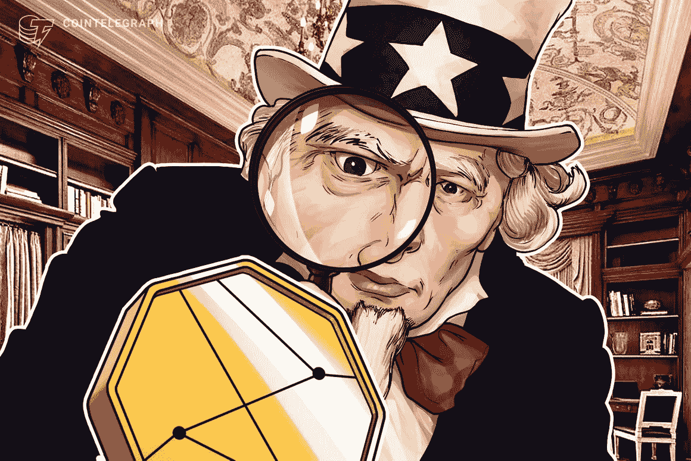

# 有可能监管西部荒野吗？

> 原文：<https://medium.com/coinmonks/is-it-possible-to-police-the-wild-west-of-crypto-8b38044aca3?source=collection_archive---------44----------------------->

Ex-Coinbase Employee and 2 Others Are Charged in Insider Trading Case. A former Coinbase Global employee and two others face wire fraud charges in what federal prosecutors in Manhattan called the first-ever insider trading case involving the market for digital currencies.

显然，两名前 CoinBase 员工被指控犯有电信欺诈罪，这是一起具有里程碑意义的涉及数字货币的内幕交易案件。

就像内特·查斯坦(Nate Chastain)所做的那样，据报道，CoinBase 的这两名员工抢在了即将上市的硬币之前，从交易中赚了超过 150 万美元。

这里有一个可怕的想法。

鉴于密码世界中不受监管的交易数量，欺诈、抢注等事件每天都在发生。

如此多的用户已经成为这种行为的牺牲品，如此多的坏人已经从道德上的灰色行为中获益，这使他们获得了可观的利润。

这些是最近才被发现的。

想象一下还有多少未被发现和未知的。

曼哈顿的联邦检察官达米安·威廉姆斯(Damian Williams)说，“欺诈就是欺诈，无论它发生在区块链还是华尔街。”" Web3 不是一个不受法律约束的区域."

Is it possible to prevent insider trading in the world of crypto?

真的吗？

让我们都冷静一下，意识到为什么 web3 会出现。

它应该是一个不受限制的地方，在那里人们可以选择交易和操纵，而不用作伪证，允许或分心。

我们开始严格监管它，增加法律和限制，完全监管它，然后会发生什么？

那不是传统金融又重来了吗？

监管机构现在正密切关注加密技术。

诈骗、洗钱和数字美元的疯狂数量实在太大了，不能再忽视了。

How hard it is to police crypto? Should we even try?

这确实让我们不得不问一些严肃的问题:

我们的界限在哪里？

谁来监管所有其他的加密交易呢？

是否有足够的资源来有效地做到这一点？

有没有一种明智而公平的方式来维持治安？

这绝对是一个有趣的空间，只会在未来的时间里增长。

监管技术、分析、网络安全和工具，将有助于当局有效监管和监控区块链，以发现和遏制犯罪。

作为一名风险投资人，这将是密码世界中一个充满希望的增长领域，我渴望了解更多。

国家和政府将在未来支付数十亿美元来有效地监管加密空间，以保护散户投资者和他们自己的利益。

-

有可能监管西部荒野吗？

-

# startups # business # startupx # growth # success # social media # culture # government # strategy # crypto # coin base # regulations # web 3 # scams # BTC # police # regulations #区块链#finance

> 交易新手？试试[加密交易机器人](/coinmonks/crypto-trading-bot-c2ffce8acb2a)或者[复制交易](/coinmonks/top-10-crypto-copy-trading-platforms-for-beginners-d0c37c7d698c)