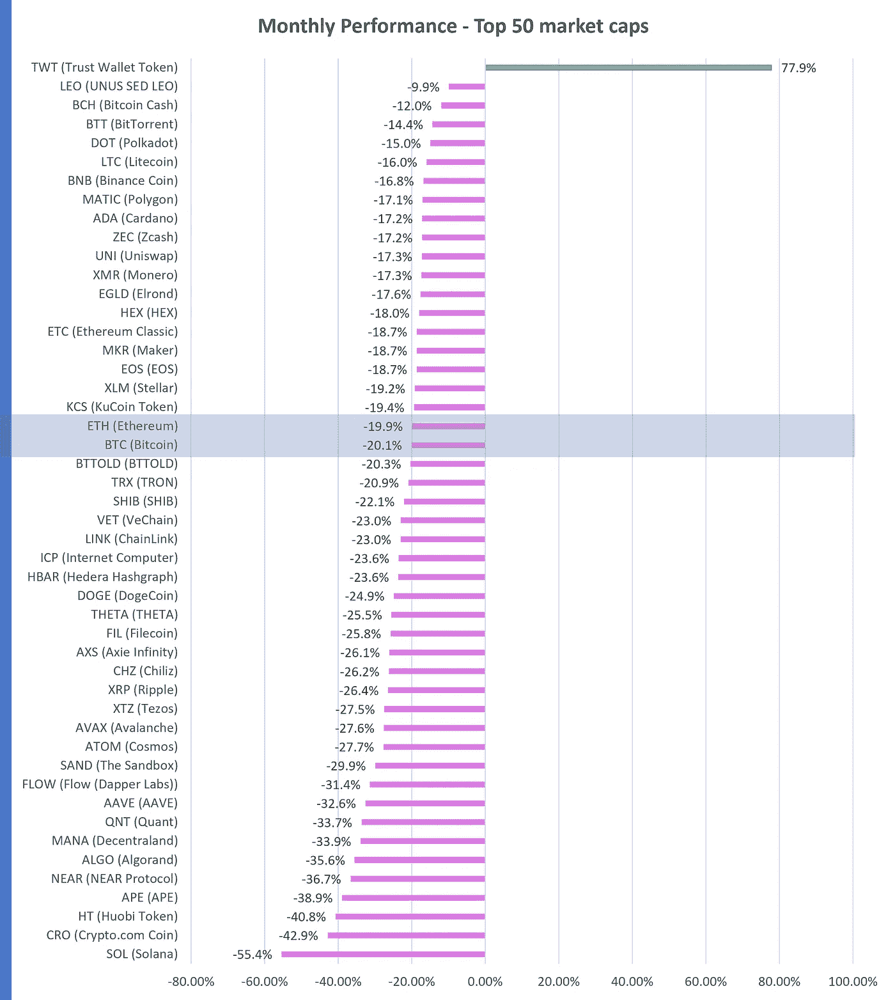
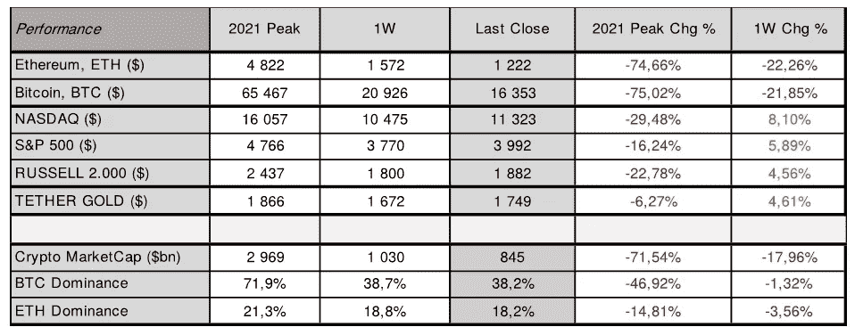

# 是时候放权了吗？每周加密和宏概述

> 原文：<https://medium.com/coinmonks/is-it-time-for-decentralization-weekly-crypto-and-macro-overview-5a58cf7bc508?source=collection_archive---------32----------------------->

我们经历了多事和动荡的一周。美国股票和数字资产市场上周大幅分化，与**纳斯达克**收盘大幅上涨 **(** [**纳斯达克**](https://finance.yahoo.com/quote/%5EIXIC?p=%5eIXIC&.tsrc=fin-srch) ⬆️ **8.10%)** 收于**11.323 美元**和 **S & P 500** 上涨**(**[**s&p500**相反，**以太坊**收盘下跌超过**(**](https://finance.yahoo.com/quote/%5EGSPC?p=%5eGSPC&.tsrc=fin-srch)[**eth**](https://altfins.com/crypto-screener)**【⬇️22%】**)报**1.222 美元**，而**比特币**结束一周也几乎下跌([**BTC**](https://altfins.com/crypto-screener)**⬇️22%)【t45)，收盘于**16.353 美元。**本周以加密领域的强劲抛售开始，随着 [**ETH**](https://altfins.com/crypto-screener) 跌至**1.073 美元， [**BTC**](https://altfins.com/crypto-screener) 跌至**15.588 美元的新低。******

**加密市场的抛售是由 Sam Bankman-Fried 的 FTX 的崩溃引起的，这是一家集中式加密交易所，在被客户的无数提款请求包围后，遭遇了 80 亿美元的流动性缺口，并最终迫使其创始人兼首席执行官在上周五申请破产程序，此前几次尝试筹集所需资本以填补其资产负债表上的漏洞失败。FTX 的崩溃拖垮了其他几家与 Sam Bankman-Fried 有关的公司，包括他的量化交易商店 Alameda Research，并在整个加密领域引起了一场浩劫。**

****根据区块链分析平台南森的数据，价值超过 20 亿美元的以太网(** [**ETH**](https://altfins.com/crypto-screener) **)离开了集中式加密交易所，这表明投资者现在正在将他们的数字资产转移到冰冷的钱包，远离集中式实体**。**

**尽管 crypto 的声誉和可信度今年受到重创，但这些事件只是进一步证明，推动更大程度的去中心化有多么重要，让投资者、交易员和客户直接掌管自己的数字资产，避免因为一个中央实体突然破产而损失资金。**因此，我们预计用户将加速转向分散式交易所(DEX ),并将他们的数字资产存放在冷钱包中。****

****

**Source: [https://altfins.com/crypto-screener](https://altfins.com/crypto-screener)**

**数字资产市场情绪( [**加密恐惧&贪婪指数**](https://alternative.me/crypto/fear-and-greed-index/) )下降到 **⬇️24/100，**这表明**极度恐惧**。上周，该指数为 33/100。由于上周 FTX 的影响， [**加密货币市场总市值**](https://coinmarketcap.com/charts/) 跌破**1 万亿美元大关，周日收盘时约为**8450 亿**，比一周前的 **⬇️15.00%** 还要低。**以太坊(**[**eth**](https://altfins.com/crypto-screener)**)的统治力**进一步下降至 **18.2%** ，比 **⬇️1.0%** 低了不止，而**比特币(**[**BTC**](https://altfins.com/crypto-screener)【t46)的统治力**下降了 **⬇️3.6%** 至 **38.2%********

****关注内容:**美联储下一次货币政策会议:2022 年 12 月 13 日至 14 日欧洲央行下一次货币政策会议:2022 年 12 月 15 日；美国 2022 年 11 月 CPI 将于 2022 年 12 月 13 日发布。**

****

**Source: [https://altfins.com/](https://altfins.com/)**

> **交易新手？尝试[加密交易机器人](/coinmonks/crypto-trading-bot-c2ffce8acb2a)或[复制交易](/coinmonks/top-10-crypto-copy-trading-platforms-for-beginners-d0c37c7d698c)**