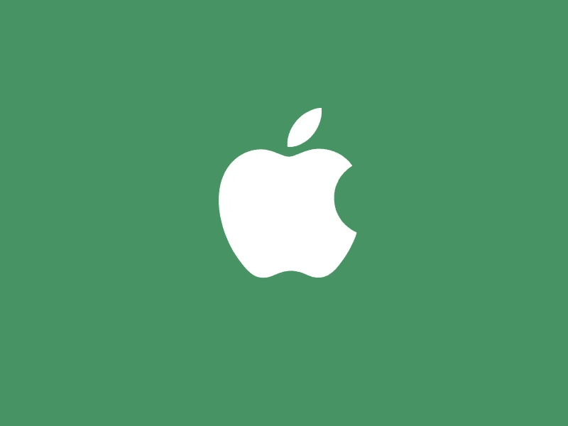

# 投资苹果值得吗？

> 原文：<https://medium.com/coinmonks/is-it-worth-investing-in-apple-54a26bf45f55?source=collection_archive---------51----------------------->

一些分析师认为，到 2022 年底，苹果的每股价值将达到 170 美元。

苹果是全球公认的数码科技品牌，在大多数用户的理解中体现了科技的优雅和时尚。这家制造商的所有标志性产品都具有大众吸引力，这使得鲜为人知的公司很难、几乎不可能与这家科技巨头竞争。但苹果的吸引力不仅在于其产品的形式，还在于投资。到目前为止，任何搜索引擎上最流行的查询是:“2022 年苹果股票预测。”让我们看看它们对投资者是否有那么大的吸引力。

**苹果的前景**

众所周知，沃伦·巴菲特投资组合中的绝大部分是苹果股票。该公司已经成为所有国际媒体关注的焦点，不仅仅是因为新 iPhone 的发布。这里还有一件事，该公司再次公布了其资本总额的数据，这相当于近 3 万亿美元，这是印度或英国国内生产总值的指标。自 2007 年推出第一代 iPhone 以来，该公司的股票已经突飞猛进。投资该公司股票的投资者获得了巨额股息。根据平均计算和预测，苹果的股价已经完全证明了自己的合理性，并产生了初始值 6000%的回报。

如果我们从长期来看投资规模，它是以积极的方式表达的。例如，据该公司称，截至 2020 年底，全球售出了超过 15 亿台设备。北美是 iPhone 和 iPad 的主要消费者。但是该公司已经扩大了其服务范围，也受到了社区的积极欢迎。例如，其中包括 2019 年与高盛和万事达卡合作推出的 Apple Card 信用卡。

如果我们从投资者的角度来看苹果股票 5 年的预测，我们可以充满信心地说，公司正在发展，这证明了投入的资金是合理的。例如，截至 2021 年底，苹果服务盈利为公司带来了超过 500 亿美元的收入，这是苹果包括销售在内的总盈利的 20%。苹果股票的股息平均每年增长约 10%，其中净收入的支付水平相当于 26%，这为公司增长和增加股息质量提供了巨大的机会。扩张和增长势头是未来增长的驱动力。

**分红历史**

该公司因从 1987 年到 1995 年支付股息而闻名。后来，随着公司专注于投资增长和扩张，支付停止了。然而，付款于 2012 年恢复；拆分支付进行了调整，投资者获得每股 0.38 美元的股息。但根据 2016 年的报告，派息已经是 0.66 美元，每股股息增长 66%。当前净收入股息支付率为 26%，支付覆盖率为 380%。所有这些都表明，该公司有某种“安全缓冲”和增加支出的每一个机会。

现在投资这家公司值得吗？

鉴于目前的全球环境，私人投资者越来越难选择有前景的股票，但苹果仍然很有吸引力。但一切都像分析师和专家说的那样顺利吗？让我们来分解一下更常见的风险:

*   市场超买——许多交易员认为，苹果股票现在正处于峰值，超买严重，在不久的将来可能会下跌。在过去的一年里，该公司的证券一直呈现平稳和持续的增长，根据市场规律，没有什么可以快速增长，在任何情况下回调都是不可避免的；
*   全球政治和经济——首先，该公司一直专注于亚洲市场，但没有人能说苹果是否会让本土巨头进入他们的空间，以及这些产品是否会像在欧美市场一样受欢迎；
*   竞争——大家都知道，苹果的亚洲竞争对手华为早就被美国列入“黑名单”，阻止了更便宜的同行流向欧美市场。现在情况可能会发生巨大变化，导致价值下降。

许多投资者现在预计该公司的股票将蓬勃发展，富有成效，但值得考虑可能存在的风险。

> 交易新手？试试[密码交易机器人](/coinmonks/crypto-trading-bot-c2ffce8acb2a)或者[复制交易](/coinmonks/top-10-crypto-copy-trading-platforms-for-beginners-d0c37c7d698c)