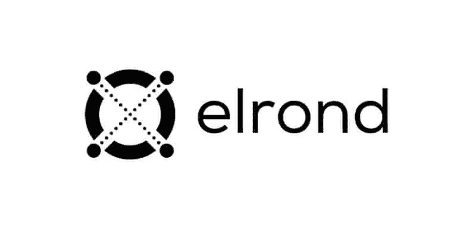

# 在埃尔隆德投资值得吗？

> 原文：<https://medium.com/coinmonks/is-it-worth-investing-in-elrond-e424db2ce82e?source=collection_archive---------11----------------------->

以《指环王》命名的加密项目“埃尔隆德硬币”是为了解决类似以太坊的区块链的可扩展性和互操作性问题而创建的。到目前为止，没有一个区块链提供了可伸缩性、分散性和安全性的完美平衡。然而，埃尔隆德希望尝试其独特的共识机制、安全利益证明(SPoS)和分片技术。找出这种加密货币是否值得…