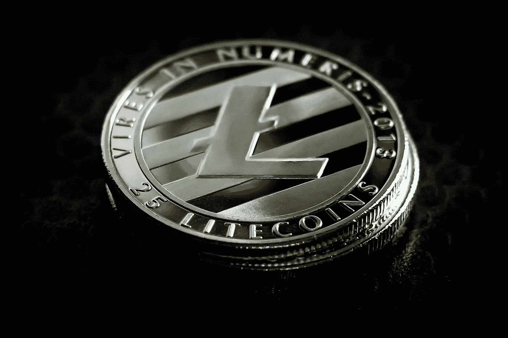

# 在圣诞节前买莱特币划算吗

> 原文：<https://medium.com/coinmonks/is-litecoin-ltc-a-good-buy-before-christmas-e7c49598eec5?source=collection_archive---------34----------------------->

Source photo [Litecoin Afaceri Finanţa — Fotografie gratuită pe Pixabay](https://pixabay.com/ro/photos/litecoin-afaceri-finan%c5%a3a-financiar-3344896/)

当价格下跌时，莱特币是一种很好的投资加密货币，因为它仍然是市场上最有价值的货币之一。这是市场上最古老的加密货币之一，诞生于比特币网络的一个分支。尽管取得了成功，但今年迄今为止，该指数出现了大幅倒退。然而，最近几周，LTC 出现了复苏的迹象，表明其命运可能正在逆转。