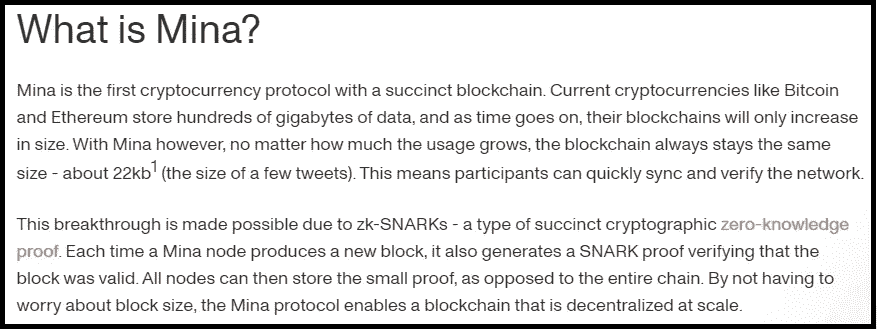

# 米娜的区块链真的只有 22kb——永远吗？

> 原文：<https://medium.com/coinmonks/is-minas-blockchain-really-only-22kb-forever-55ddf8aa9022?source=collection_archive---------29----------------------->

MINA 声称它的区块链只有 22kb 大小，而且永远不会增加——只要看看他们在文档中的第一段摘录就知道了:

[https://docs.minaprotocol.com/en](https://docs.minaprotocol.com/en)

这些文件将比特币和以太坊的数百千兆字节数据(还在增加)的完整链与米娜始终如一的 22kb“区块链”进行了比较。他们所做的比较和他们使用的语言是明确的，不可否认的:他们希望投资者相信 MINA 的区块链，整个链，是 22kb，并且永远都是。他们希望投资者相信，他们已经通过找到密码学的圣杯解决了规模问题。他们希望投资者相信，所有其他链(如比特币和以太坊)将永远增长到一个越来越沉重的规模，不像米娜那样新颖而完美的创新。

然而，在下一段中，他们称之为“小证据，而不是整个链条”。他们没有明确指出“小证明”即“SNARK 证明”是第一段中提到的 22kb 对象，但很容易意识到这就是他们的意思。

无论使用量增长多少，区块链总是保持相同的大小—大约 22kb。因此，这就引出了一个问题:在只有 22k 个字母的空间中，MINA 如何准确地容纳假设的一百万个事务？嗯，不能。无论是谁创建了 MINA 文档，无论是谁管理他们的市场，当他们说 MINA 的区块链是 22kb 时，他们都在撒谎。22kb 的字符串只是整个区块链的一个证明，换句话说，你可以用 22kb 来确保整个区块链，或者它的一部分是有效的。这肯定是一个伟大的功能，但他们通过欺骗来推销它，声称这是整个区块链，这显然是 MINA 的头号卖点，这是一个被广泛关注的东西。区块链可以是静态大小的唯一方式是:1。不再添加交易 2。删除交易记录以便添加新交易记录。

一个比喻:
这就像把圣经放入一个哈希生成器，以生成阿沙-256 哈希(我做了，见下文)，然后声称圣经是这个十六进制的字符串:“30 B1 b5 adfb 1c 35980 EAE 65 c 15 b 60 DD 8590598 ee 062076d 611 D8 D7 a 53 b 7 c 227 BD”

在这个比喻中，米娜会说，你需要 64 个字符来拥有圣经。你能用这 64 个字符做什么？如果我给你我上传的圣经，然后你做同样的过程创建一个散列，你会发现我们的散列匹配。这就是为什么它是有用的，以确保数据的完整性。但是，如果地球上所有的圣经都被销毁和删除，这份杂凑也不会给你带来多少好处，因为杂凑不是圣经。在这方面，米娜 22kb 证明不是区块链。米娜·区块链不能从 22kb 的校样中重现，就像你不能从 64 个字符串中重现圣经一样。

米娜使用非常清晰和欺骗性的语言，以使人们认为实际的区块链是 22kb，这是不正确的。

> 交易新手？试试[加密交易机器人](/coinmonks/crypto-trading-bot-c2ffce8acb2a)或者[复制交易](/coinmonks/top-10-crypto-copy-trading-platforms-for-beginners-d0c37c7d698c)