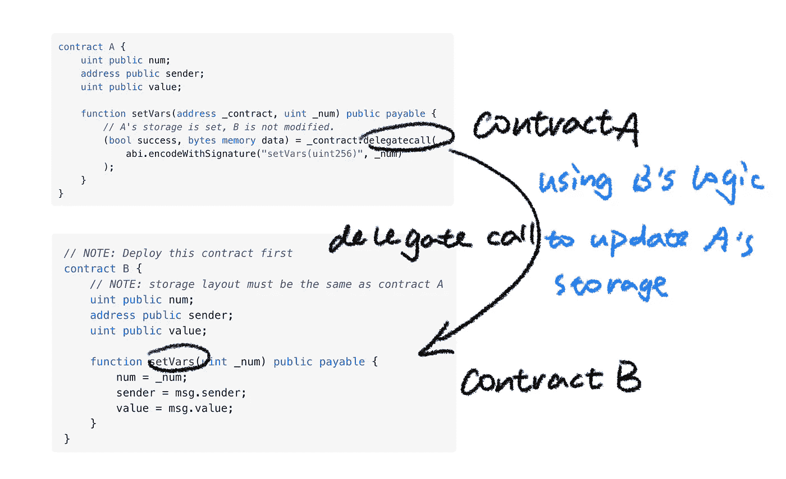
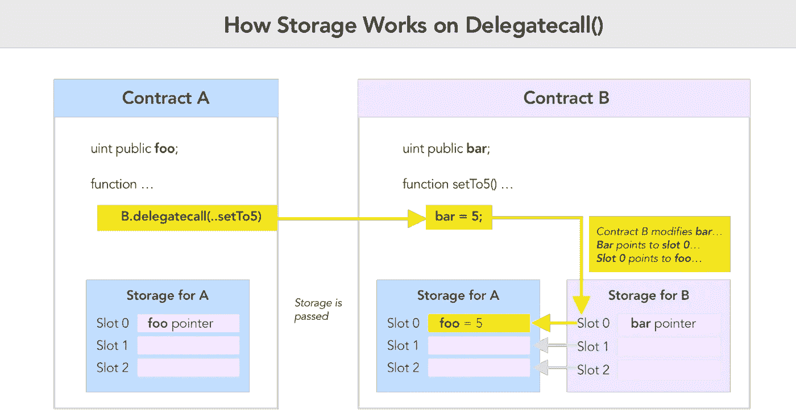
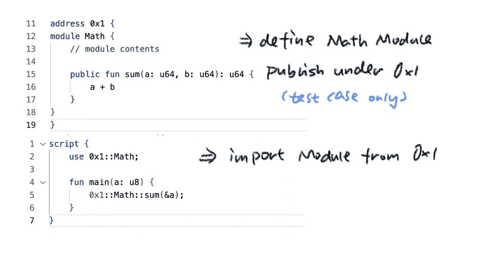
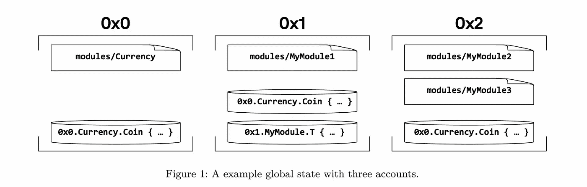

# Move 是有前途的语言吗？(第一部分。出色的模块可组合性)

> 原文：<https://medium.com/coinmonks/is-move-a-promising-language-part-1-brilliant-module-composability-58021762ee22?source=collection_archive---------21----------------------->

# 第一部分。B **rilliant** 模块可组合性

最近，时薪 1200 美元的移动语言真的很流行。Move 是一种智能合约语言，不同于 solidity，它有自己的虚拟机和存储设计。那么如何判断一门新语言是否有前途呢？我对 move 做了一些研究，得出了以下想法:

# 组件

当试图编写移动契约时，你可能首先注意到的一个明显区别是库的导入方式，以及与 solidity 相比，使用公共模块有多方便。

先说图书馆是如何在 solidity 中工作的。想象一个场景，您想要部署一个 ERC20 契约并发布您自己的令牌，您可能需要使用您的`npm hardhat`或`forge install`安装 openzepplin 库，以便在本地下载公共契约模板，并且在部署时，您必须部署库和您自己的代码。如果有太多的代码，你甚至可能不得不处理`StackOverflow`错误，比如把你的合同分成几部分，然后分别部署，但这有点不友好，因为不同的合同不能共享相同的存储。所以你有没有想过:为什么我要一次又一次地部署相同的库代码，而肯定有很多人以前做过同样的事情。或者换句话说，既然代码已经在链上了，为什么我们不能共享库呢？要知道，以太坊上的存储资源是一笔巨大的成本。

实际上，以太坊试图通过引入`delegate call`来解决这个`library`问题。有关该提案的详细信息可在[这里](https://eips.ethereum.org/EIPS/eip-7)找到。但可悲的是，它并不像预期的那样有效。

这里有两张图片显示了在一个`delegate call:`后面发生了什么

simple example of delegate call

delegate call storage

乍看起来很不错，`delegate call`使契约 A 能够调用契约 B 的函数，但代码实际上是在契约 B 的 vm 中执行的。

这带来了一些限制和不安全感。一个是你需要保持你的合约存储对应于你要委托调用的合约。如上所示，契约 A 应该定义与契约 B 相同的字段。另一个是可能存在安全问题，你必须确保契约 B 是完全可信的，并且你非常清楚契约 B 中的功能(误用`delegate call`会导致很多灾难)。

那么 move 是如何解决这个问题的呢？

让我们看一个简单的例子:

这里有一个可以做 uint64 加法的模块。这个模块将在哪里发布。提醒一下，我们只在测试用例中使用`0x1`，实际上地址应该是部署者的地址。在脚本中，我们可以将`math`模块作为一个库导入并自由使用该函数。

所以在 move 中，你可以导入模块，用它们来执行你自己的逻辑，自然就像 java 或者 python 中的动态调用。

这太酷了，因为你可以把整个区块链想象成一个巨大的公共代码库，在那里你可以调用由酷极客定义的模块，并用它们来组成你自己的逻辑。就像下面的图片所示，每个地址可以有许多模块充当方便的乐高积木！

移动生态系统现在仍然是超级早期，但我相信在不久的将来，dope 模块将在其上繁荣，这一定是一个不同于 EVM 的全新世界。

> 交易新手？试试[加密交易机器人](/coinmonks/crypto-trading-bot-c2ffce8acb2a)或者[复制交易](/coinmonks/top-10-crypto-copy-trading-platforms-for-beginners-d0c37c7d698c)