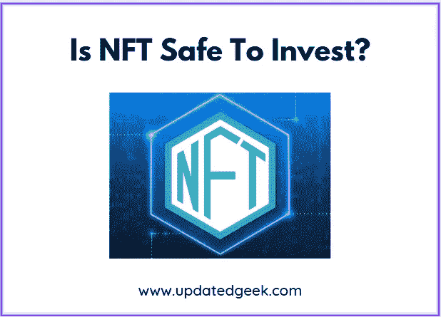
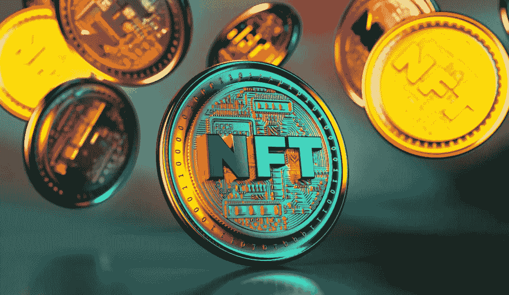

# 在 NFT 投资安全吗？

> 原文：<https://medium.com/coinmonks/is-nft-safe-to-invest-4775355628ca?source=collection_archive---------40----------------------->

Is NFT Safe To Invest?

是的，投资 NFT 是安全的。它代表现实世界资产的数字所有权。在投资 NFT 之前，你必须清楚收益和风险。

# 什么是 NFT？还是 NFT 的意思？还是 NFT 的意思？

**NFT 或不可替代代币**通常是在用于加密货币的编程类型的帮助下创建的。简而言之，NFT 是基于区块链技术的加密资产。但是，它们不能像其他加密资产一样等价交易或交换。

就像比特币或以太坊一样，由于其独特的属性，NFT 代表着它既不能互换，也不能替代。加密货币和实物货币是可互换的，这意味着它们可以从一个人交换或交易给另一个人。

NFT 是数字艺术和收藏品，就像全世界每个人都相信比特币一样。一些关键特征是:

*   独一无二:它不能被操纵或伪造
*   交换:NFT 的交换是在特定的网站上用加密货币进行的
*   数字资产:NFT 是一种数字资产，展示互联网收藏品，如艺术，游戏，音乐等，具有由区块链使用的技术建立的真实证书。

**NFT 的一些例子是**

1.域名

2.时尚系列运动鞋

3.比赛

4.试图

5.数字收藏品

**又念:**[2023 年你还要继续投资股市吗？](https://updatedgeek.com/keep-investing-in-the-stock-market/)

# 在 NFT 投资有什么好处？

有几个原因支持在 NFT 投资

**1。发展和增长的潜力:** NFT 有发展和增长的潜力，例如，在房地产领域，拥有和控制一个虚拟区域就有了决定如何处理土地的权力。你可以建立一个安全可靠的企业，也可以租用它。

**2。给予投资者更多的流动性:**令牌化资产在投资者有需求的时候提供流动性。例如，如果投资者拥有一个虚拟区域，并决定将其出租给广告商或影响者，以获得回报。

**3。创建标记化的资产价值:**艺术品等实物通过 NFTs 进行标记化。它减少了艺术品被复制的机会，并限制了艺术家的所有权。这导致了艺术品的价值和稀缺性。

**4。学习的机会:** NFT 为投资者提供了一个学习区块链技术的机会，同时通过向令牌化资产分配特定金额来分散投资组合。

**5。任何人都可以投资:**任何人都可以投资令牌化资产，它们可以在世界各地的人们之间轻松转移。

**6。所有权由区块链保护:**资产的所有权由区块链技术保护，以数字方式表示所有权。它使资产的所有权更加透明。

**又读:** [比特币开采是否破坏环境？](https://updatedgeek.com/does-bitcoin-mining-damage-the-environment/)

# 在 NFT 投资有什么风险？

投资 NFT 有几个相关的风险因素

**1。NFT 生产是极度能源密集型的:**目前，以太坊区块链支持大部分的非功能性传输，它使用一种被称为工作证明的能源密集型操作协议。每笔 NFT 交易都需要一个家庭用一天半的电。

**2。NFT 不是资产类别:**NFT 通常被认为是一种资产类别，而不是代表所有者的技术方式。普通的错误信息以及与 NFT 相关的炒作会导致令牌化资产的价值波动和膨胀。

**3。需要有以太坊:**大部分销售发生在 NFT 的以太坊平台上，因此需要拥有区块链本地货币以太才能进行购买。希望用法定货币购买 NFT 的投资者选择有限。

**也读作:** [加密货币应该大写吗？](https://updatedgeek.com/should-cryptocurrency-be-capitalized/)

# 你能和 NFT 一起赔钱吗？或者在 NFT 投资安全吗？

随着人们对 NFT 越来越熟悉，它们的售价也随之上涨。一些卖家已经从出售 NFT 中赚了数百万。

和 NFT 一起，你可能会赔钱。对 NFT 市场来说，这是一个新市场，可能很难销售，因为你可能无法确定公众想要什么。

你应该期待与有经验的投资者交易，他们知道如何控制购买和销售价格，以防止他们的钱损失。

这意味着你可能会以小额存款而不是大额存款告终，从而导致巨额亏损。

**也读:** [信用卡额度是基于收入吗？](https://updatedgeek.com/is-credit-card-limit-based-on-income/)

# 我如何在 NFT 投资？

1.创建加密钱包

2.将加密钱包链接到 OpenSea 帐户

3.购买以太坊购买 NFT

4.创建一个你的艺术收藏

5.生成集合的 NFT

6.列出待售的 NFT

7.在粉丝中推广你的 NFT

每当你得到一个 NFT 的买家，就会得到以太坊

**亦读:** [投资 NPS 值得吗？](https://updatedgeek.com/is-investing-in-nps-worth-it/)

# NFT 比加密更危险吗？

**是的，NFT 比加密**风险更大，因为它类似于对加密的杠杆化押注。对于新投资者来说，这类似于赌博，因为他们不知道两者的区别，也不知道何时购买。他们认为这是一项有趣的活动。

# 常见问题

**1。在 NFT 投资是个好主意吗？**

是的，在 NFT 投资是个好主意。

**2。买 NFT 能让你变得富有吗？**

是的，如果你遵循适当的纪律，购买 NFT 可以让你变得富有。

**3。每个人都在 NFT 赚钱吗？**

不，不是每个人都在 NFT 赚钱。

**4。买 crypto 好还是买 NFT 好？**

这取决于你的选择，无论你发现有利可图。

**相关搜索**

[如何申请 2023 年 E Mudra 贷款](https://updatedgeek.com/how-to-apply-for-e-mudra-loan/)

[2023 年夏普投资划算吗](https://updatedgeek.com/is-sharp-investment-a-good-buy/)

[特斯拉 2023 年至 2034 年股价目标](https://updatedgeek.com/tesla-stock-price-target/)

[(技术分析)苹果公司 2023 年至 2030 年股价目标](https://updatedgeek.com/apple-inc-share-price-target/)

[(价格图表)2022 年 11 月你应该购买的 3 种最佳加密货币](https://updatedgeek.com/best-cryptocurrency-to-buy-november/)

**关注更多更新**

*在 LinkedIn* 上关注[*Raveen Chawla*](https://www.linkedin.com/in/raveen-chawla-02b3017b)

**相关搜索，点击* [*文章*](https://updatedgeek.com/) *，点击* [*网络故事*](https://updatedgeek.com/web-story-sitemap.xml)*

> *交易新手？尝试[加密交易机器人](/coinmonks/crypto-trading-bot-c2ffce8acb2a)或[复制交易](/coinmonks/top-10-crypto-copy-trading-platforms-for-beginners-d0c37c7d698c)*
> 
> *多样化密码持有，了解[币安替代品](https://coincodecap.com/binance-alternatives)*
> 
> *加入 Coinmonks [电报频道](https://t.me/coincodecap)和 [Youtube 频道](https://www.youtube.com/c/coinmonks/videos)获取每日[加密新闻](http://coincodecap.com/)*

# *另外，阅读*

*   *[复制交易](/coinmonks/top-10-crypto-copy-trading-platforms-for-beginners-d0c37c7d698c) | [加密税务软件](/coinmonks/crypto-tax-software-ed4b4810e338)*
*   *[网格交易](https://coincodecap.com/grid-trading) | [加密硬件钱包](/coinmonks/the-best-cryptocurrency-hardware-wallets-of-2020-e28b1c124069)*
*   *[密码电报信号](/coinmonks/top-3-telegram-channels-for-crypto-traders-in-2021-8385f4411ff4) | [密码交易机器人](/coinmonks/crypto-trading-bot-c2ffce8acb2a)*
*   *[最佳加密交易所](/coinmonks/crypto-exchange-dd2f9d6f3769) | [印度最佳加密交易所](/coinmonks/bitcoin-exchange-in-india-7f1fe79715c9)*
*   *开发人员的最佳加密 API*
*   *最佳[密码借贷平台](/coinmonks/top-5-crypto-lending-platforms-in-2020-that-you-need-to-know-a1b675cec3fa)*
*   *[免费加密信号](/coinmonks/free-crypto-signals-48b25e61a8da) | [加密交易机器人](/coinmonks/crypto-trading-bot-c2ffce8acb2a)*
*   *[杠杆代币](/coinmonks/leveraged-token-3f5257808b22)终极指南*