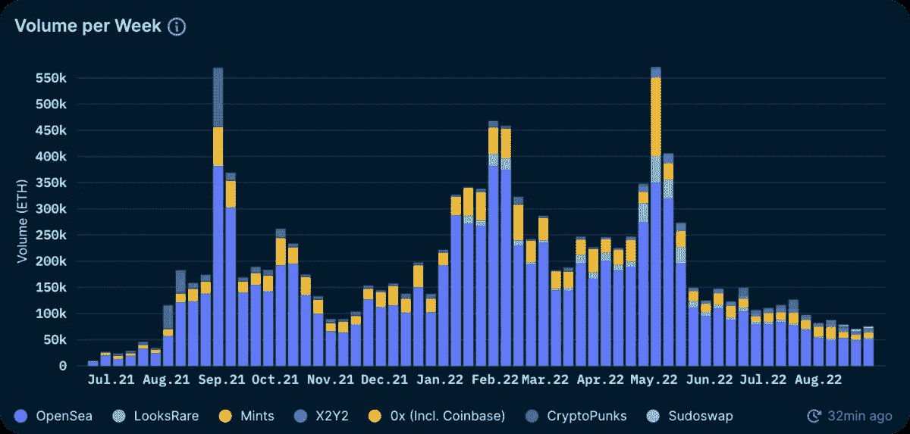

# Opensea 正在消亡吗？

> 原文：<https://medium.com/coinmonks/is-opensea-fizzling-out-d359e15b083c?source=collection_archive---------32----------------------->

Is Opensea turning in a desert?

NFT 最大的交易平台之一 Opensea 上的 NFT 交易量在 4 个月内下降了 99%。

Opensea 是一个 NFT 市场，通过从交易中抽取佣金来赚钱。

更多的交易意味着更多的收入。

5 月 1 日，OpenSea 处理了约 27 亿美元的交易。

8 月 28 日，OpenSea 处理了约 934 万美元的交易。

与此同时，OpenSea 失去了大约 1/3 的用户。

”与此同时，OpenSea 的日用户数从 1 月 9 日的 58，870 下降到 8 月 27 日的 23，620。在同一时间段内，日交易量从 13.75 万笔降至仅 5.33 万笔。”

这看起来肯定不太好。

但是为什么呢？

有几种可能性。

如果你没注意到，现在是秘密的冬天。

游客离开了小镇，市场暴跌，加密货币价格暴跌。

这意味着对密码的普遍兴趣被削弱了。

加密市场通常会追随比特币的脚步。

当 BTC 崛起时，一切都随之而来。

当 BTC 下跌时，它通常也预示着其他一切的严重低迷。

Dropping 99% so quickly in anything isn’t good. But is this the early signs of the end of NFTs?

即使是顶级非金融资产的底价也受到了巨大冲击。

无聊的猿人、神秘的朋克和小红帽的价值都大幅下降。

也许在经济衰退期间，人们会出售资产以获得现金。

像 crypto 这样的易变资产，尤其是 NFT，通常是最先消失的。

所以只有坚定和有信念的人会留下来。

或者，也许 NFT 泡沫终于破裂了！

人们也可以认为非功能性测试本质上是没有价值的。

最终，市场恢复了理智，人们不再相信它们。

嗯，所有行业、市场和想法都会发生这种情况。

任何新的和非传统的东西都会受到质疑、嘲笑和挑战。

给他们时间。

让我们看看这条路通向哪里。

我们都知道 99%的 NFT 都是骗局，地毯，恶心，抢钱和设计糟糕。

那么，当 NFT 最大的交易所之一的交易量下降 99%时，我们为什么会感到惊讶呢？

我们应该高兴地看到坏鸡蛋被过滤掉了。

**Open Sea** is perhaps the most popular — and, by far, the largest — NFT marketplace nowadays. It’s the original peer-to-peer alternative to buy and sell non-fungible tokens online, and it has surpassed a trading volume of $20 billion.

NFT 比你的典型资产更有趣。

除了我们赋予每个 NFT 的价值之外，请记住，我们与 ETH(大部分反正)和其他加密货币进行 NFT 交易，这些货币本身也有价值。

因此，当熊市来袭时，加密货币和 NFT 的价值都会下跌。

这是双重打击。

哎哟。

但我相信 Opensea 正走在正确的道路上，当市场变绿时，他们将像以前一样收获收益。

如果他们降低燃烧率，保持船的稳定，继续在 R&D 进行适当的投资，不断改进他们的技术和护城河，他们将能够安然度过这场风暴。

你相信 NFTs 吗？

你绝对相信 NFTs 能提供光明的未来吗？

那么，也许是时候去购买一些“不良 NFT”了。

-

NFTs 会再次繁荣吗？

-

# startups # business # startupx # growth # success # social media # culture # entrepreneurs # strategy # eth # BTC # crypto # opensea # markets # bear market # NFT # profits # NFT market

> 交易新手？试试[加密交易机器人](/coinmonks/crypto-trading-bot-c2ffce8acb2a)或者[复制交易](/coinmonks/top-10-crypto-copy-trading-platforms-for-beginners-d0c37c7d698c)