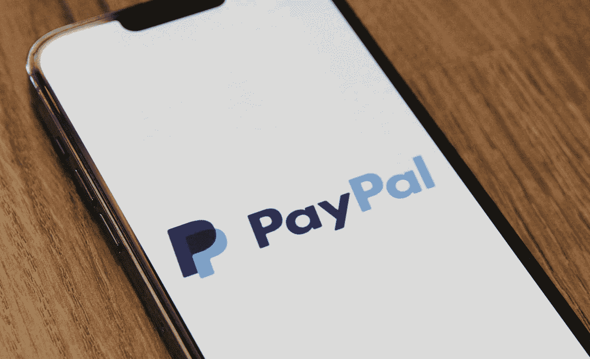

# Paypal (PYPL)股票是一个好的投资吗？

> 原文：<https://medium.com/coinmonks/is-paypal-pypl-stock-a-good-investment-52e686967ec0?source=collection_archive---------21----------------------->

Source photo Unsplash.com

全球领先的数字支付公司 PayPal 是我们牛市中的下一只股票(纳斯达克股票代码:PYPL)。目前全世界有 4 . 3 亿个账户与它连接。

4 月 27 日，PayPal 公布了第一季度财务业绩。收入同比增长 8%，至 65 亿美元。与此同时，调整后的每股利润从去年的 1.22 美元降至 88 美分…