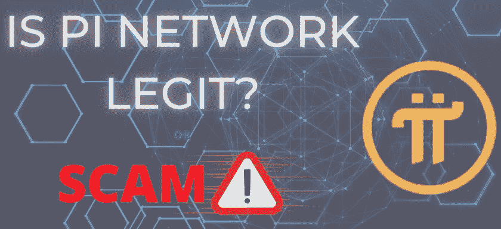

# pi 加密货币合法吗？还是骗局？

> 原文：<https://medium.com/coinmonks/is-pi-cryptocurrency-legit-or-scam-1ddef29c68ff?source=collection_archive---------7----------------------->

Pi Network 指的是数字货币项目，旨在允许日常用户访问加密挖掘。它允许用户使用他们的手机应用程序来支付加密货币。2019 年 3 月 14 日(Pi 日)承诺书随 Pi 开矿申请寄出。Ads 于 2020 年 5 月启动该项目。12 月 29 日，Pi mainnet 上线。

根据 pi 管理部门的说法，“PI 硬币，Pi，是在 Pi 组织中工作的加密货币，它驱动着 Pi 区块链。所有网络交易都用它来收费和支付。 [**利用网络的开发团队**](https://cryptotime4u.com/) 必须持有 Pi 令牌才能利用自己的资产

管理将强调分散的独立关联(DAO ), PI 令牌旨在作为管理令牌工作。"

# pi 加密货币是如何工作的？

这个协会开始了一项任务，寻找一种允许习惯性个人开采 pi 加密货币的方法。他们的回答暗示你可以通过从你的手机中挖掘密码来赚钱。本质上是下载应用程序，并在日常打开时打开它，从而[**挖掘 pi**](https://cryptotime4u.com/) 加密货币。PI 组织同样有一个个人平台。[为**刀**为](https://cryptotime4u.com/)。令牌持有者可以决定对组织的推荐。"

经过 3 年的创业运动，最近 Pi 网络创始人和核心团队推出了 mainnet。

# pi 加密货币的提取或兑换

这是一个 [***封闭的主网***](https://cryptotime4u.com/cryptocurrency-2022-3-predictions-make-it-a-big-year-for-bitcoin-nfts-and-more/)*暗示着，只有在生态系统内部的个体才能利用他们的圆周率币进行交换和交易。这是额外的那些谁通过了 KYC 检查。到目前为止，100/国家(至少 150 个国家)15000 个人已经完成了他们的 KYC。最近又有 50 个国家超过了 KYC。多达 22000+个人在生态系统内交易他们的 pi 加密货币。*

*这一时期将持续到 2022 年 6 月 28 日。但是 KYC 还在继续。众多用户尚未完成圆周率加密货币的 [**KYC，仍在等待 KYC，等待 KYC 按钮出现在他们的个人资料上。**](https://cryptotime4u.com/)*

# *Pi 网络是骗局还是合法？*

*[阅读更多](https://cryptotime4u.com/is-pi-cryptocurrency-legit-or-scam/)*

> *交易新手？尝试[加密交易机器人](/coinmonks/crypto-trading-bot-c2ffce8acb2a)或[复制交易](/coinmonks/top-10-crypto-copy-trading-platforms-for-beginners-d0c37c7d698c)*