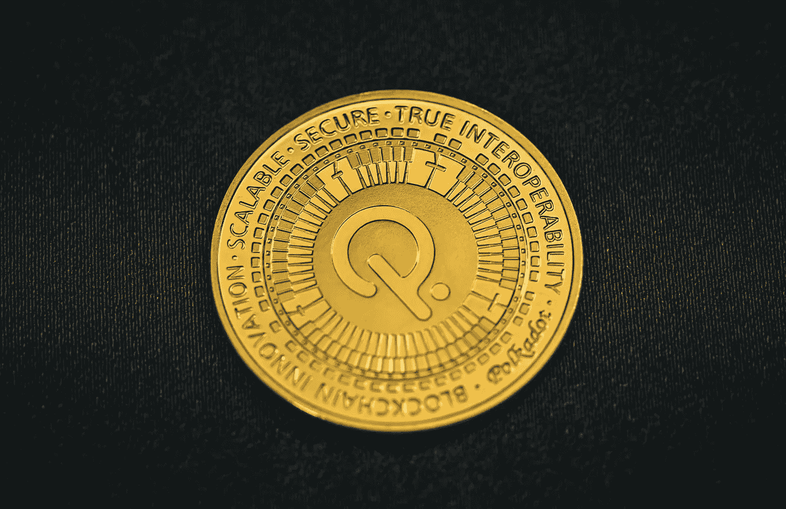

# 波尔卡多特(dot)是 2023 年的好投资吗？

> 原文：<https://medium.com/coinmonks/is-polkadot-dot-a-good-investement-for-2023-1358e97d63f7?source=collection_archive---------18----------------------->

Source photo [HD photo by Traxer (unsplash.com)](https://unsplash.com/photos/DDHb_Fmlz2k)

2020 年，以太坊的联合创始人加文·伍德发布了他的波尔卡多特区块链。该平台试图通过在可互操作的区块链生态系统上创建一个更具可扩展性的智能合约平台来超越以太坊。它由 Web3 基金会建立，是一个开源的区块链平台。

该小组的目标是开发一个可访问的和功能齐全的分散…