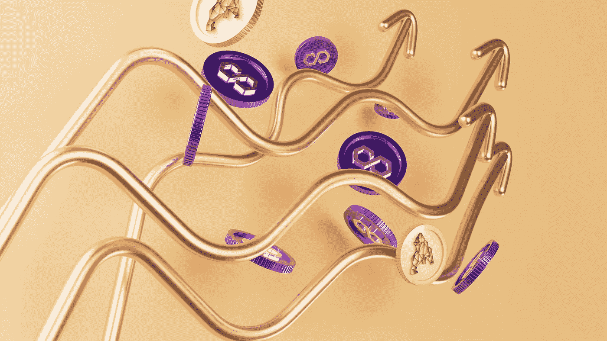

# 圣诞节前买多边形(MATIC)好吗

> 原文：<https://medium.com/coinmonks/is-polygon-matic-a-good-buy-before-christmas-d6ca4f30e4d7?source=collection_archive---------43----------------------->

Source photo [Free Crypto Image on Unsplash](https://unsplash.com/photos/ehaoA14lYMc)

与其他区块链相比，MATIC 上的交易更便宜、更快捷、更安全、更值得信赖，而且该网络的设计消除了在分散环境中运营的挑战。由 Joseph Poon 和 Vitalik 撰写的《等离子体框架》是其发布的推动力。

多边形，以太坊版的区块链互联网，是 MATIC 网络的继承者。如果你是…