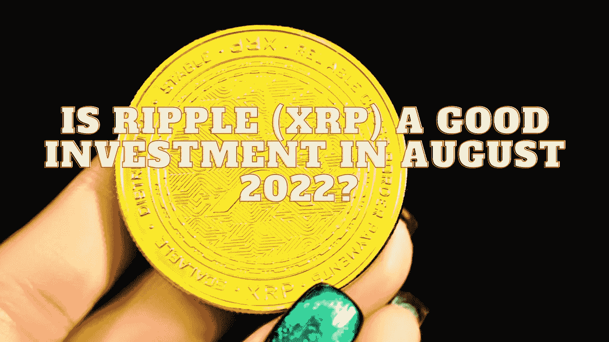

# 2022 年 8 月 Ripple (XRP)是个好投资吗？

> 原文：<https://medium.com/coinmonks/is-ripple-xrp-a-good-investment-in-august-2022-f7384c1fdd51?source=collection_archive---------9----------------------->

Source photo Unsplash.com

2012 年 Ripple 推出时，许多评论人士称其为“比特币黑仔”。它对神秘未来诗的意义得到了广泛的认可..此外，XRP 在全球所有主要的密码交易所都有上市，交易量的不断扩大和 XRP 钱包数量的不断增加就表明了这一点。