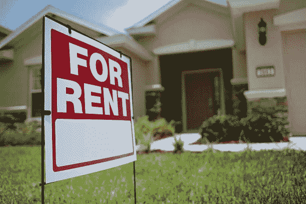
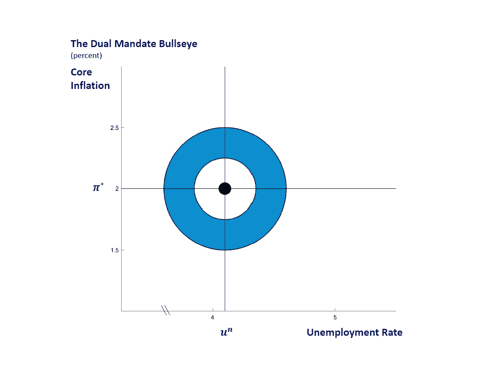
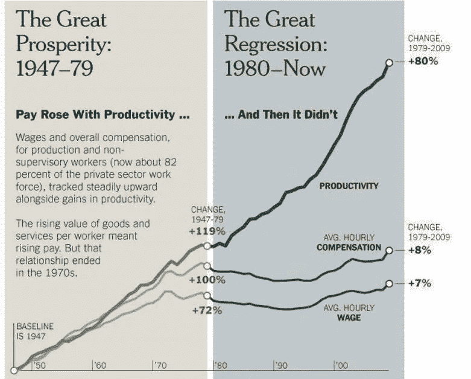
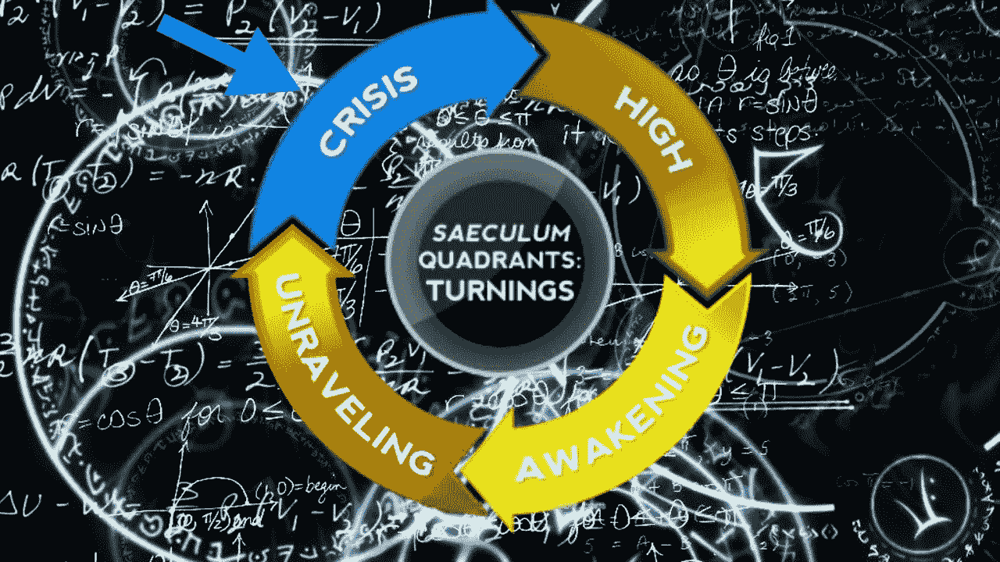

# 租金上涨是失败的金融体系的产物还是副作用？

> 原文：<https://medium.com/coinmonks/is-rising-rent-a-product-or-side-effect-of-a-failing-financial-system-2e0690c2ad7f?source=collection_archive---------32----------------------->

最近，消费者似乎受到了各方面的打击。从超市价格上涨，能源价格飙升，到现在的房租飙升。许多租房者坚持要求暂缓，但随着生活成本现在超过全国年薪，租房者犹豫不决。租赁市场同比出现了两位数的增长。

全国平均租金从 1-BR 公寓的 1，254 美元增加到 1，721 美元，增幅为 27%，而 2-BR 公寓的租金从 1，572 美元增加到 2，054 美元，增幅为 23%。其他州的房租也在上涨，包括:俄勒冈州 102%，新墨西哥州 82%，新罕布什尔州 151%。在过去的一年里，这些州仍然是租金上涨最严重的州。

在冠状病毒疫情的第一年，我们受到疾病控制中心(Center for Disease Control，简称 CDC)实施的驱逐禁令的保护 2021 年 8 月，最高法院的多数裁决结束了暂停。三名左倾法官反对这一裁决，称这将危及受病毒爆发影响的数百万人。

有些人可能会提出，我们目前正在目睹一个问题的后果，在这个问题上，政治和经济在一个陈旧的金融体系中走到了紧要关头，很难辨别。许多(如果不是所有的话)由政治操纵的中央货币体系，更具体地说，是由两党官僚操纵的中央货币体系，都是如此。真正的解决方案经常被捐助者混淆，而且很难有利于他们据称应该代表的选民。

## 通货膨胀与工资增长和就业

政治运作叙事的问题在于，它们通过误导和分裂掩盖了真正的问题。政治倡导者会让你相信，撕掉创可贴，让美联储控制通胀，最符合自由市场经济的利益。他们以购买债券和零利率的形式制造了同样的通货膨胀。

联邦债券购买允许美国政府在“科罗纳疫情”期间资助社会项目和发放其他援助。左翼党派主张这些计划的功效是作为雇员必要的安全网，以失业救济的形式，以税收和个人隐私为代价。右倾党派人士认为，这些计划不利于经济增长，相反，他们倾向于美国公民的工资保护计划和刺激计划。

问题是这些政治资助项目的任何一方都是有代价的。他们以政府公共援助或大企业救助的形式创造临时解决方案。这些项目的成本是通货膨胀。央行可以被比作一个在独木舟上来回抛线的飞鱼，驶向尼亚加拉瀑布。这个类比中的鱼和线是通货膨胀和利率，而悬崖或尼亚加拉瀑布是威廉·施特劳斯和尼尔·豪描述的第四次转折的影响。

你可以通过征税和提高利率来遏制通货膨胀，也就是所谓的量化紧缩(QT)，或者你可以通过购买美国债券和低利率来摆脱通货膨胀，也就是所谓的量化宽松(QE)。但在一天结束时，你仍然会走向金融悬崖或尼亚加拉大瀑布。

问题在于中央银行系统与一个破碎的政治体系联系在一起。两者都不擅长解决潜在的银行基础设施问题。美联储的双重使命是将通胀率保持在略高于 GDP(衡量经济产出的指标)的 2%左右。美联储或美联储的第二个使命是保持“最大限度的可持续就业”

在 2020 年几乎将联邦债务增加三分之一，从 20 万亿美元增加到 30 万亿美元之后，这可能是疫情危机带来的繁荣，现在终于开始在全球范围内感受到涟漪。美联储一直能够通过失业救济和其他公共项目来延长通胀，这些项目允许 M2 的货币供应相对潜伏。然而，随着创纪录的低失业率，M2 的货币供应正在产生通胀压力，如果不加控制，这种压力很容易转变为恶性通胀。

Dual Mandate targets a 4.1% Unemployment Rate

用美联储前主席艾伦·格林斯潘(Alan Greenspan)的话来说，大多数大专院校教授的现代货币理论(MMT)会让你相信，只要有资产可供购买，主权政府就可以通过印刷摆脱通胀和债务。从长远来看，为更高的债务服务融资所带来的这种负担是不可持续的，它依赖于这样一种信念，即政府将信守承诺，通常以债券利息或印钞的形式偿还所述债务。还记得飞钓者的比喻吗？

你会问，通货膨胀有什么不好？通货膨胀从本质上降低了你的收入潜力，因为它降低了你的价值结构，而自 1979 年以来，工资增长就没有跟上这一结构。美联储将美元从固定汇率转向浮动汇率之前的时代的结束。它在 1973 年让美元与金本位脱钩，这被称为*“大回归”*那段时间的工资增长在 2017 年增长了 8.9%，如果包括过去 5 年，则增长了 12.42%。与此同时，通货膨胀率上升了 482.91%，超过工资增长近 5 倍。

这不仅导致了美元贬值，还造成了工薪阶层和高收入阶层之间差距的扩大。与此同时，生产率也上升了 120%以上，标志着主管职位和中层管理人员的减少。工人在做更多的工作，中产阶级在萎缩。

## 第四次转弯

在威廉·施特劳斯和尼尔·豪的书《第四次转折》中，他们描绘了一个国家基于世代原型所经历的四个阶段或“转折”。这本书对 21 世纪的描述与我们自 2008 年以来所目睹的类似，即大衰退、911 恐怖袭击以及最近的疫情。

如果这本书只说对了一半，那么我们已经进入了第四个转折，即最后的危机转折。这本书以惊人的准确性描述了乌克兰/俄罗斯战争，目前影响欧洲大部分地区的石油制裁，以及政府即将无力偿还债务。

如果这本书实现了它的预言，美国政府将会破产或无力偿还债务。养老金和社会保障将变得越来越不可获得，并从福利项目转向基于富裕与否的合格项目。账户余额将会消失，投资将变得缺乏流动性，分类账将会消失。

这本书接着给出了几个反乌托邦的未来；然而，未来可能不像作者描述的那样黯淡。*第四个转折*确实提到了一种可能，即通过复活当前体系的新版本，以一种新的范式实现民族国家的重生，对此我并不一定抱有多大热情。

## 避免危机

如果未来的故事像《第四次转折》中的*一样令人沮丧，其后果将是削弱当前的基础设施，无论是金融还是政治。目前的央行无法通过印刷摆脱当前的债务负担，也无法无限期地维持下去。流通中也永远不会有足够的法定货币来为上述债务融资。随着这些债务的增加，以债券购买形式发行的债务融资所需的金额将日益减少。从美国债券市场的反向收益率曲线就可以看出这一点，表明投资者对黯淡的前景犹豫不决。*

如果其他国家是一个指标，美国可能不得不在未来开始支付负利率，以鼓励进一步的投资。其他国家目前正在探索的一个选项是中央银行数字货币或 CBDCs。数字货币，或者更普遍的说法是密码，可以为传统金融系统提供对冲。加密货币不受与传统政府支持的法定货币相关的央行束缚。

最近 3AC、Voyager Digital 和 Terra/Luna 的相继清盘让这些公司受到了 SEC 的审查；然而，也许还有一线希望。有传言称，未来各国央行可能会通过使用央行数字货币(简称 CBDCs)来与类似项目合作。CBDCs 有可能为类似的不稳定加密项目及其流动性问题提供解决方案。向分散的稳定债券提供流动性也可以暂时平息美联储的通胀担忧，同时鼓励大规模采用。将政府金融工具与数字货币捆绑在一起，而不是将其视为网络威胁，可能会证明对加密银行和央行都有利。美联储未来的加息不太可能单独抑制通胀，因此这可能是退而求其次的选择。

> 交易新手？试试[加密交易机器人](/coinmonks/crypto-trading-bot-c2ffce8acb2a)或者[复制交易](/coinmonks/top-10-crypto-copy-trading-platforms-for-beginners-d0c37c7d698c)