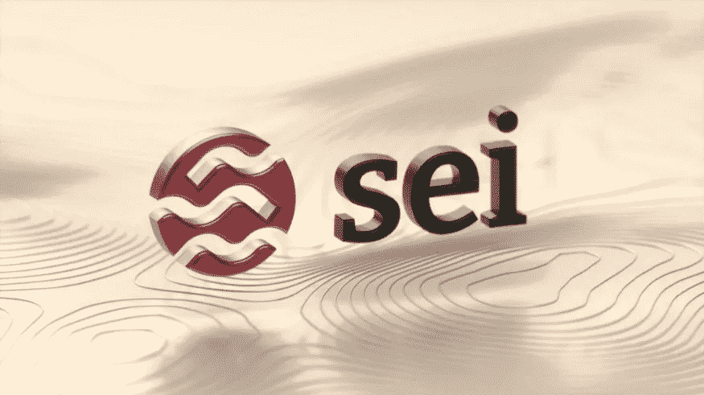

# Sei 是下一个 bullrun 的黑马吗？

> 原文：<https://medium.com/coinmonks/is-sei-the-dark-horse-of-the-next-bullrun-373b93613369?source=collection_archive---------49----------------------->

**Sei 是为 DeFi 世界设计的第 1 层区块链**。它的独特之处是什么？这个项目能为密码球和区块链技术提供什么解决方案？现在让我们弄清楚它，并试着突出主要的用例以及大量已经存在的第一级解决方案之间的差异。

**谁投资了？**
Sei 最近完成了一轮 500 万美元的融资，投资方包括 Multicoincap、比特币基地和德尔福数码等。

**项目目标、优势和用例。**
该项目的主要目标是为 DeFi 应用创建最好的第 1 层区块链。Sei 优先考虑可靠性、安全性和高吞吐量，创造了全新的 DeFi 产品梯队。基于 Sei 的程序可以使用内置的订单匹配引擎来即时开发任何类型的资产和金融产品的市场。与这个大优势相结合的是，Sei 是基于 Cosmos SDK 构建的，这意味着它将兼容 IBC(区块链间通信)。

**Sei 的主要优势:**

1.  自己的订单簿，这将有助于提高 Sei 上 dexes 的可伸缩性。
2.  集中限价订单簿(CLOB)是 Sei 独有的，它允许你在其上建立 dApps。这将是 AMM 模式的一个有用的替代方案，其他 L1 网络逐个处理订单，这使得它们很慢。
3.  快速交易处理 600 毫秒。比 Solana 快 5 倍，比 Sui 和 Aptos 快 2 倍。
4.  权力下放。
5.  提前运行预防—处理大量频繁的订单。
6.  自动订单批处理—在一个模块中处理大量交易。
7.  这个生态系统已经有超过 50 个团队在 Sei 上构建他们的技术。

**总结:** Sei 是基于 Cosmos SDK 构建的高级第 1 层区块链，体现了密码学的最佳范例。该项目的主要目标是为交易和 DeFi 协议创建一个强大的架构。通过将订单簿构建到基础设施中，dApps 将拥有 DeFi 所需的内置速度和可扩展性，这是其他 L1 解决方案无法提供的。该项目已经拥有了一个庞大的生态系统，并为进一步发展收集了知名面包师的投资。所以 Sei 肯定是有前途的，可以成为下一个 bullrun 的宝石。

[Linkthree](https://linktr.ee/seinetwork) 上的 Sei 资源。

感谢关注，再见✌️

> 交易新手？尝试[加密交易机器人](/coinmonks/crypto-trading-bot-c2ffce8acb2a)或[复制交易](/coinmonks/top-10-crypto-copy-trading-platforms-for-beginners-d0c37c7d698c)