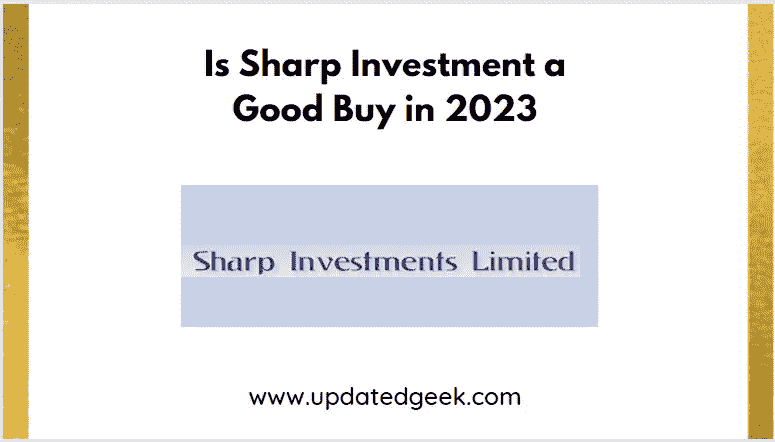
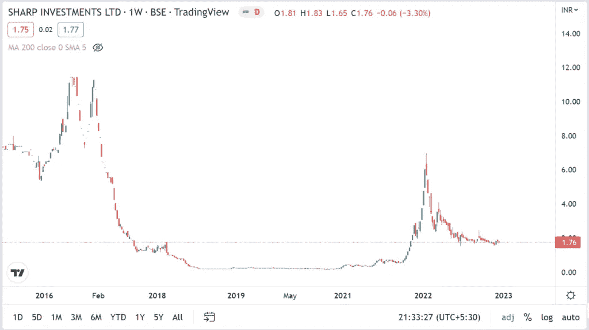
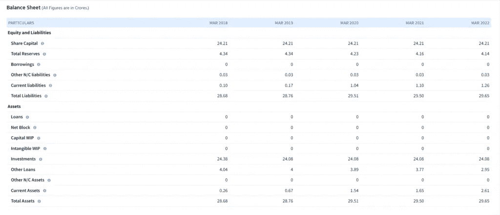
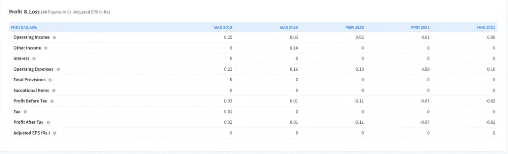

# 夏普投资在 2023 年划算吗

> 原文：<https://medium.com/coinmonks/is-sharp-investment-a-good-buy-in-2023-99e786d89d79?source=collection_archive---------54----------------------->

是的，夏普投资有限公司是 2023 年的好买卖。但是你必须通过财务和技术分析，在决定购买股票之前做好你的研究。

Is Sharp Investment a Good Buy in 2023

在这篇文章中，我提出了一个详细的分析夏普投资有限公司的股票，支持在股票投资。

> 从顶级交易者那里复制交易机器人。免费试用。

# 什么是夏普投资有限公司？

**夏普投资有限公司**是一家以从事证券和股票投资业务为目的而组建的公司。该组织在印度储备银行注册为非银行金融公司。该公司成立于 1977 年 11 月 28 日，并根据 1956 年《公司法》第 149 节获得开业证书。该公司最初由迪巴卡尔·查特吉先生、马丹·昌德·贾恩先生和伯德希·昌德·贾恩先生创立。目前，该组织从事贷款和股票投资。

# 夏普投资有限公司的股价是多少？

夏普投资有限公司目前的**股价为 1.77 卢比。该股已触及 2022 年 1 月最高价 7 卢比。**

**也读作**

*   [IRFC 股价目标 2023、2024、2025、2026、2027、2028、2029、2030 —更新极客](https://updatedgeek.com/irfc-share-price-target/)
*   [塔塔电力 2023 年、2024 年、2025 年和 2030 年的股价目标|技术分析和基本面分析](https://updatedgeek.com/tata-power-share-price-target/)
*   [IRCTC 2023 年、2024 年、2025 年和 2030 年的股价目标](https://updatedgeek.com/irctc-share-price-target/)
*   [LIC 股价目标 2023 年、2024 年、2025 年和 2030 年](https://updatedgeek.com/lic-share-price-target/)

# 夏普投资有限公司价格表

Sharp Investment Ltd price chart

# 夏普投资财务报表

Sharp Investment Ltd balance sheet

Sharp Investment Ltd profit & loss statement

# 夏普投资有限公司的目标价格

夏普投资有限公司是一项不错的长期投资，尤其是如果你打算投资一年以上的话。1 年后的目标价有望触及 2.31 卢比。5 年后的目标价有望越过 4.57 卢比。

也阅读

> [(技术分析)Bajaj 金融股价目标 2023、2025、2030、2035](https://updatedgeek.com/bajaj-finance-share-price-and-target/)
> 
> [(技术分析)HDFC 股份 2025、2030、2035 年股价目标](https://updatedgeek.com/hdfc-ltd-share-price-target/)
> 
> 为什么信用卡或借记卡会有有效期？
> 
> [(技术分析)Bajaj 金融股价目标 2023、2025、2030、2035](https://updatedgeek.com/bajaj-finance-share-price-and-target/)
> 
> [(技术分析)Muthoot Finance 股价目标 2023 年、2025 年、2030 年、2035 年](https://updatedgeek.com/muthoot-finance-share-price-target/)

# 夏普投资有限公司股票见解

1.  去年全年收入增长 1002.56%。该部门上一财年的平均收入增长率为 2.52%。
2.  去年全年净利润增长 79.44%。该部门上一财年的平均净利润增长率为 45.03%。
3.  由于该公司无债务，债务对权益比率为零。
4.  发起人承诺为零。
5.  市盈率为-921.05，低于其 25.66 的行业市盈率。

# 我如何购买夏普投资有限公司的股票？

你可以从印度最好的经纪人那里购买夏普投资有限公司的股票。[点击链接](https://link.upstox.com/DQT7YCUH7irWFzFM6)

# 常见问题

**1。夏普投资有限公司的未来如何？**

夏普投资有限公司有望翻番。因此，投资夏普投资有限公司可能是一个有利可图的投资选择。

**2。有没有其他股票在未来几年有翻倍的潜力？**

另一只有能力翻倍的股票是创意眼有限公司。

**相关搜索**

> [为什么 2022 年你不应该现在就在印度购买电动汽车？](https://updatedgeek.com/why-not-buy-electric-vehicle-in-india/)
> 
> [(价格图表)2022 年 11 月你应该购买的 3 种最佳加密货币](https://updatedgeek.com/best-cryptocurrency-to-buy-november/)
> 
> [2023 年还要继续投资股市吗？](https://updatedgeek.com/keep-investing-in-the-stock-market/)
> 
> [加密货币应该大写吗？](https://updatedgeek.com/should-cryptocurrency-be-capitalized/)
> 
> HDFC 信用卡可以和 Google Pay 连接吗？

**关注更多更新**

*在 LinkedIn* 上关注[*Raveen Chawla*](https://www.linkedin.com/in/raveen-chawla-02b3017b)

**相关搜索，点击* [*文章*](https://updatedgeek.com/) *，点击* [*网络故事*](https://updatedgeek.com/web-story-sitemap.xml)*

> *交易新手？尝试[加密交易机器人](/coinmonks/crypto-trading-bot-c2ffce8acb2a)或[复制交易](/coinmonks/top-10-crypto-copy-trading-platforms-for-beginners-d0c37c7d698c)*

*   *[如何购买 Monero](https://coincodecap.com/buy-monero) | [IDEX 评论](https://coincodecap.com/idex-review) | [BitKan 交易机器人](https://coincodecap.com/bitkan-trading-bot)*
*   *[CoinDCX 评论](/coinmonks/coindcx-review-8444db3621a2) | [加密保证金交易交易所](https://coincodecap.com/crypto-margin-trading-exchanges)*
*   *[红狗赌场评论](https://coincodecap.com/red-dog-casino-review) | [Swyftx 评论](https://coincodecap.com/swyftx-review) | [CoinGate 评论](https://coincodecap.com/coingate-review)*
*   *[Bookmap 评论](https://coincodecap.com/bookmap-review-2021-best-trading-software) | [美国 5 大最佳加密交易所](https://coincodecap.com/crypto-exchange-usa)*