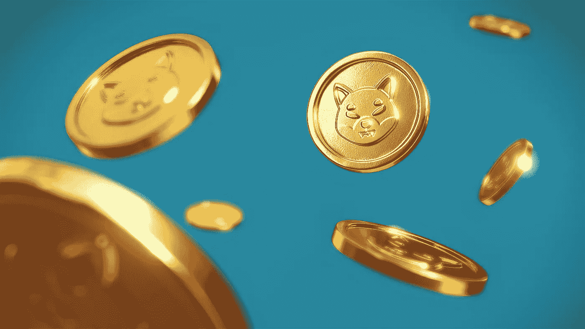

# 柴犬(SHIB)是个好投资吗？

> 原文：<https://medium.com/coinmonks/is-shiba-inu-shib-a-good-investment-a6cfbf731a9c?source=collection_archive---------21----------------------->

Source photo [Free Crypto Image on Unsplash](https://unsplash.com/photos/YOCDD-D4oOM)

说到迷因币，柴犬是目前加密领域最知名的之一。尽管 Q1 2022 的价格下降，但 Memecoin 和类似的数字资产仍然令人兴奋。这就是为什么许多市场观察人士认为柴犬是他们投资组合的首选。

柴犬相对于其他加密货币的低廉价格是一大卖点。新投资者…