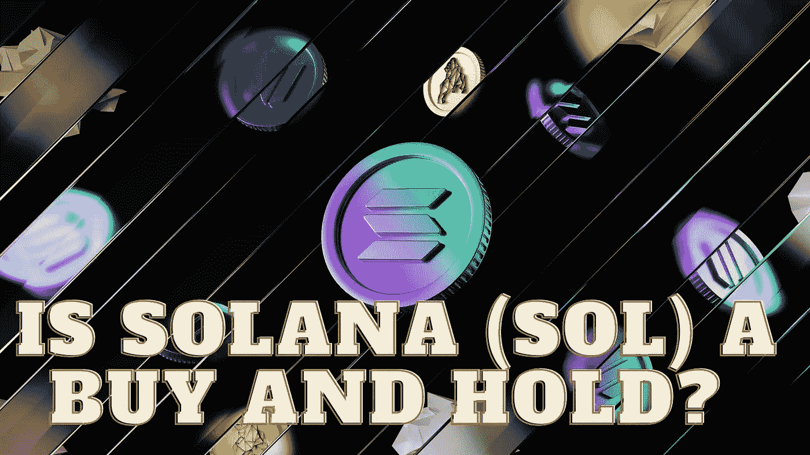

# 索拉纳(SOL)是买入并持有吗？

> 原文：<https://medium.com/coinmonks/is-solana-sol-a-buy-and-hold-943b5f50cd91?source=collection_archive---------40----------------------->

Source photo Unsplash.com

凭借其闪电般的交易速度和低廉的交易费用，Solana 是第四代区块链和加密货币的尖端产品。然而，该网络因其闪电般的交易速度而受到称赞，它可以处理超过 65，000 TPS，平均成本为 0.00025 美元。索拉纳为支付行业带来了尖端技术，意在引发一场革命。