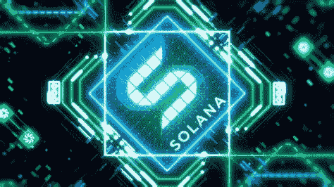

# 索拉纳(SOL)是买入并持有吗？

> 原文：<https://medium.com/coinmonks/is-solana-sol-a-buy-and-hold-fd9cd717bf0b?source=collection_archive---------29----------------------->

Source photo [solana good buy — Bing images](https://www.bing.com/images/search?view=detailV2&ccid=25nR7dUe&id=8B31AA4763EBB9857474231989748F57EE6693FA&thid=OIP.25nR7dUegCyTrRKkI7SxWwHaEK&mediaurl=https%3a%2f%2fcryptovot.com%2fwp-content%2fuploads%2f2021%2f06%2fSolana-Price-Up-13.4-to-30.48-%e2%80%93-Where-to-Buy-SOL.jpg&cdnurl=https%3a%2f%2fth.bing.com%2fth%2fid%2fR.db99d1edd51e802c93ad12a423b4b15b%3frik%3d%252bpNm7lePdIkZIw%26pid%3dImgRaw%26r%3d0&exph=1080&expw=1920&q=solana+good+buy&simid=608037721624226840&FORM=IRPRST&ck=6AF1C6D25CEE028605EDF1A077B0DAED&selectedIndex=9&ajaxhist=0&ajaxserp=0)

索拉纳智能合约平台是同类平台中发展最快的..在两年的时间内，它的受欢迎程度和用户群激增，网络上的开发者活动激增，SOL token 的价值增长了 13000 多倍，其市值达到 780 亿美元以上，Solana 网络的生态系统迅速繁荣。