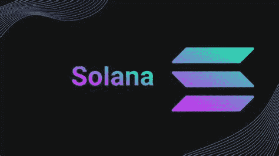

# 索拉纳(SOL)是个好买卖吗？

> 原文：<https://medium.com/coinmonks/is-solana-sol-a-good-buy-68a8ba334ec8?source=collection_archive---------47----------------------->

Source photo [solana — Bing images](https://www.bing.com/images/search?view=detailV2&ccid=0bBdC8si&id=B6B1B40FE6AA0356CF7FF336E806411E95A0F0C7&thid=OIP.0bBdC8siAmTD7MgzNj51TgHaEK&mediaurl=https%3a%2f%2fcointopsecret.com%2fwp-content%2fuploads%2f2021%2f08%2fExploring-the-Solana-Ecosystem-Design-1068x601.jpg&cdnurl=https%3a%2f%2fth.bing.com%2fth%2fid%2fR.d1b05d0bcb220264c3ecc833363e754e%3frik%3dx%252fCglR5BBug28w%26pid%3dImgRaw%26r%3d0&exph=601&expw=1068&q=solana&simid=608027856089671400&FORM=IRPRST&ck=D8611AE3814D4E2D6903BEB9F9F19DA5&selectedIndex=0&ajaxhist=0&ajaxserp=0)

这种高性能的分散加密区块链平台被称为 Solana，它允许交易同时变得安全、可伸缩和快速。SOL 是 Solana 的母语区块链，是收取交易费用和维护网络安全的手段。

为了连接和发展最受欢迎的区块链，它于 2017 年通过创新技术建成。努力的结果是…