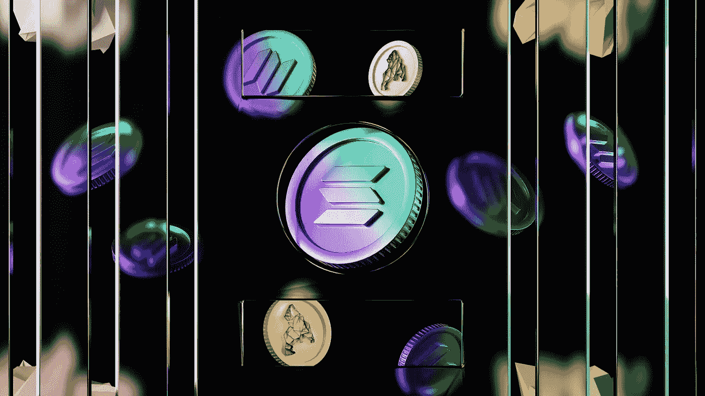

# 索拉纳(SOL)2023 年投资好吗？

> 原文：<https://medium.com/coinmonks/is-solana-sol-a-good-investment-in-2023-39c99fd6411f?source=collection_archive---------36----------------------->

Source photo Unsplash.com

说到加密货币和区块链，索拉纳是扩张最快的生态系统之一。例如，在首次亮相后不到两年，它就创下了历史新高，其价值比最初的硬币发行(ICO)价格增长了 12，000%以上。

它已经损失了峰值的近 80%,但仍高于其起点。它还…