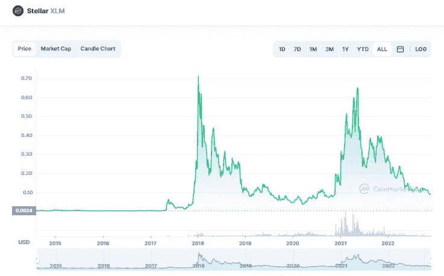

# 恒星(XLM)是 2023 年的好投资吗？

> 原文：<https://medium.com/coinmonks/is-stellar-xlm-a-good-investment-for-2023-15f6a03332c0?source=collection_archive---------21----------------------->

Source photo [Stellar price today, XLM to USD live, marketcap and chart | CoinMarketCap](https://coinmarketcap.com/currencies/stellar/)

恒星流明是一种加密货币，可以使用恒星流明网络快速廉价地转移，恒星流明网络是一个位于区块链的分散支付网络。流明是恒星的内部加密货币(XLM)。XLM 是一种加密货币，可用于支付和接收支付，以及在加密货币交易所进行兑换。