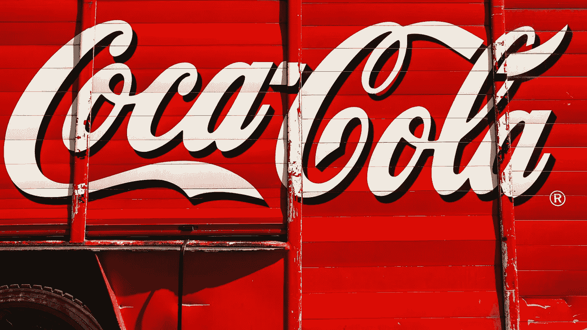

# 可口可乐股票仍然是一个好的投资吗？

> 原文：<https://medium.com/coinmonks/is-still-coca-cola-stock-a-good-investment-f7cb31a208e2?source=collection_archive---------23----------------------->

Source photo Unsplash.com

自 1892 年以来一直存在，现在基本上提供与一个多世纪前相同的软饮料的可口可乐(纽约证券交易所代码:KO)在这一点上作为投资有点过时，这是有道理的。然而，事实并非如此。无论经济形势如何，这家总部位于亚特兰大的公司总是设法找到新的方法来振兴其业务并保持销售增长。