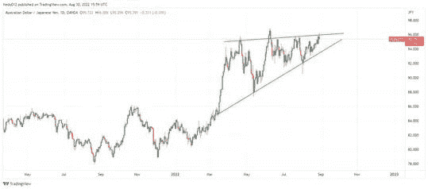

# 对于交易来说技术分析就够了吗？

> 原文：<https://medium.com/coinmonks/is-technical-analysis-enough-for-trading-678832c323a3?source=collection_archive---------18----------------------->

Image by [Chikwem Chinedu Ogugua](https://liquiditytradeideas.com/participant/admin/) on [Liquiditytradeideas](https://liquiditytradeideas.com/)

[**技术分析足够交易吗？**](https://liquiditytradeideas.com/is-technical-analysis-enough-for-trading/) 刚接触交易或者对金融市场上正在进行的关于交易技术分析的概念感到困惑？如果是这样的话，那么你就可以享受一下了。

在这篇文章中，我们将讨论技术分析对交易来说足够了吗，什么是技术分析，金融市场中使用的三种最重要的分析类型，技术分析的好处，以及技术分析在交易中的局限性和常见缺点。

# 介绍

分析金融资产和做出投资决策的过程会因个人的具体财务状况和交易目标而异。

然而，给[新手和投资者](https://liquiditytradeideas.com/which-trading-is-best-for-beginners/)的一些一般提示是理解不同类型的市场分析和它们如何运作，以及它们可以用来交易或投资的不同类型的工具。

# 什么是技术分析？

技术分析是通过研究过去的价格和模式来预测金融工具、资产等的未来价格的过程和艺术。它常用于交易和投资。

[技术分析](https://liquiditytradeideas.com/is-technical-analysis-useless/)是交易者和投资者做出明智投资决策的有力途径。通过了解价格如何变动，你可以更好地预测未来的高点和低点，做出更好的交易和投资。

 [## 交易和投资哪个更赚钱？

### 交易和投资哪个更赚钱？交易和投资是一个长期争论的问题。那里…

liquiditytradeideas.com](https://liquiditytradeideas.com/which-is-more-profitable-trading-or-investing/) 

# 交易中还有其他类型的分析吗？

交易分析是识别市场模式和趋势，并利用这些信息做出明智的投资决策的过程。许多不同类型的分析可以用于交易和投资。

# 基本面分析

在交易和投资中，基本面分析是对市场趋势和影响市场趋势的因素的研究。这可能包括对资产价格、供求、公司基本面和财务比率的分析。

# 技术分析

技术分析使用图表来预测市场的未来趋势。技术分析是任何交易者或投资者武器库的重要组成部分，可以帮助识别金融市场中的获利机会。

# 情感分析

情绪分析是一种用于确定交易者和投资者对金融资产的积极、消极和中性情绪的方法，这种情绪通过文本来表达。它是一种文本分析的形式，使用机器学习算法来分析文本，并猜测你的感受。

虽然技术分析侧重于理解市场中出现的模式，并可用于识别市场中的趋势和模式，但趋势和价格分析在交易或投资时也很有用。

 [## 外汇交易是好是坏？-流动性交易理念

### 外汇交易是好是坏？当然，像任何活动一样，外汇交易几乎没有什么风险…

liquiditytradeideas.com](https://liquiditytradeideas.com/is-forex-trading-good-or-bad/) 

# 使用技术分析有什么好处？

技术分析帮助你做出投资决策。交易分析最重要的一个方面是能够识别市场趋势。使用技术分析有几个好处，其中包括:

*   了解市场趋势和价格趋势
*   根据市场情况做出明智的投资决策
*   在股票和其他资产中寻找机会
*   预测未来资产价格和其他财务信息
*   理解价格变化的潜在影响

有各种不同类型的技术分析可以使用，包括蜡烛图分析，技术指标，趋势分析和价格分析。蜡烛图分析是一种可视化一段时间内价格变动的方法。

[技术指标](https://liquiditytradeideas.com/trading-indicators-explained/)是在金融市场中分析资产时使用的工具，它被放置在价格图表上，可以帮助交易者和投资者识别市场中的某些信号和趋势。

趋势分析可用于识别市场是否正在经历一个特定的趋势，并可用于预测市场是否会继续朝着某个方向发展

价格分析可以用来确定一个给定的价格是过高还是过低，也可以用来预测市场未来的走势。

Analysis by [Chikwem Chinedu Ogugua](https://liquiditytradeideas.com/participant/admin/) on [Liquiditytradeideas](https://liquiditytradeideas.com/)

# 使用技术分析的常见弊端是什么？

交易时使用技术分析有一些潜在的缺点。没有经验的交易者和投资者很难使用技术分析。在交易和投资时，这可能会导致一个艰难的决策过程，因为很难决定使用哪个工具，或者信任哪个工具，忽略哪个工具。

第二，技术分析在经济时期很难使用。这可能导致错过机会，因为很难知道哪种资产会受到政策和利率的影响，以跟上最新的市场状况。

 [## 2022 年投资长期流动性交易理念的最佳密码

### 2022 年长期投资的最佳密码！想知道是否可以投资一种回报丰厚的加密货币…

liquiditytradeideas.com](https://liquiditytradeideas.com/best-crypto-to-invest-in-2022-for-long-term/) 

# 技术分析的局限性是什么？

技术分析是一种利用数学模型来预测未来事件的分析形式。技术分析用于识别市场中的潜在机会，并做出投资决策。

技术分析最常见的限制是:

*   技术分析是一个非常具体和有限的工具，只能提供有限的未来洞察力。
*   技术分析并不总是可靠的，也可能不准确。
*   技术分析可能很难使用，而且很耗时。
*   技术分析可能很难理解，对新手来说也很难应用

# 技术分析中最常用的工具

有许多不同类型的工具被使用，它包括，[移动平均线](https://liquiditytradeideas.com/top-10-powerful-trading-indicators/)，随机和烛台。移动平均技术指标显示当前趋势是积极的还是消极的。随机指标衡量波动性和动量。蜡烛图用于分析过去的价格和识别模式。

# 那么，对于交易来说，技术分析就足够了吗？

技术分析的目标是发现市场行为的模式。这些模式可以用来预测未来的价格走势。技术交易者关注的是股票在一定范围内的天数，股票在高点或低点以上交易的次数，以及波动的幅度。

精通技术分析需要时间和练习。然而，一旦你掌握了它，你就能发现趋势并准确预测股票的走向。

 [## 十大强有力的交易指标——流动性交易理念

### 想知道是否有值得关注的技术指标来洞察市场行为？继续…

liquiditytradeideas.com](https://liquiditytradeideas.com/top-10-powerful-trading-indicators/) 

# 谁应该使用技术分析？

而技术分析可以用来识别模式，做出明智的交易和投资决策。对交易和投资感兴趣的人有必要识别金融市场的潜在机会。

# 结论

技术分析是一种分析过去价格行为来预测未来价格的方法。它包括使用图表、指标和图表模式知识来识别趋势和预测资产价格。

技术分析师使用移动平均线、布林线、[斐波纳契回撤线](https://liquiditytradeideas.com/top-10-powerful-trading-indicators/)和成交量等工具来帮助他们确定趋势是否存在以及有多强。有人认为技术分析是废话，有人认为是必要的，是否足够取决于你的交易风格。

我们希望这篇文章是有帮助的，并希望收到您的来信！请在下面的评论区分享你的想法和经历，让我们知道你的想法。

如果您想获得更多关于交易和投资相关主题的技术分析信息，请加入我们的[论坛](https://liquiditytradeideas.com/community/)以保持更新，并随时与我们联系

*原载于 2022 年 8 月 30 日 https://liquiditytradeideas.com***。**

# *来自 LiquidityTradeIdeas 的消息*

*感谢您成为我们社区的一员！在你离开之前:*

*   *👏为故事鼓掌，跟着作者走👉*
*   *📰在 [**中查看更多内容**](https://liquiditytradeideas.com/)*
*   ***📈**加入我们的 [**论坛**](https://liquiditytradeideas.com/community/)*
*   *📚发现 [**最佳交易电子书**](https://liquiditytradeideas.com/trading-e-books/)*

> *交易新手？尝试[加密交易机器人](/coinmonks/crypto-trading-bot-c2ffce8acb2a)或[复制交易](/coinmonks/top-10-crypto-copy-trading-platforms-for-beginners-d0c37c7d698c)*