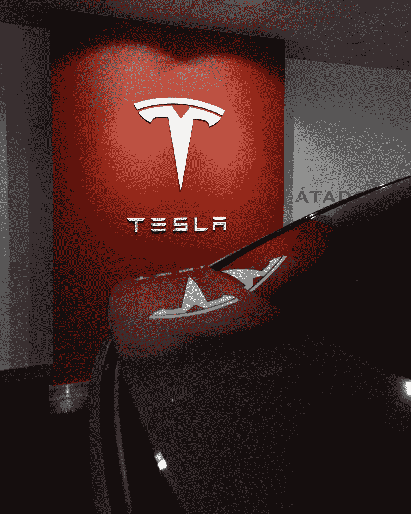

# 特斯拉股票现在是个好投资吗？

> 原文：<https://medium.com/coinmonks/is-tesla-stock-a-good-investment-right-now-e7ba56dc0003?source=collection_archive---------44----------------------->

Source photo Unsplash.com

尽管该基金的波动，特斯拉是方舟最大的持股。特斯拉股票“仅”比其历史高点低 46%，但交易价格比其 52 周低点高出约 10%。这比许多成长型股票的表现要好很多。

然而，股票市场对该公司最近业绩的反应并不热烈。虽然整个股票市场已经…