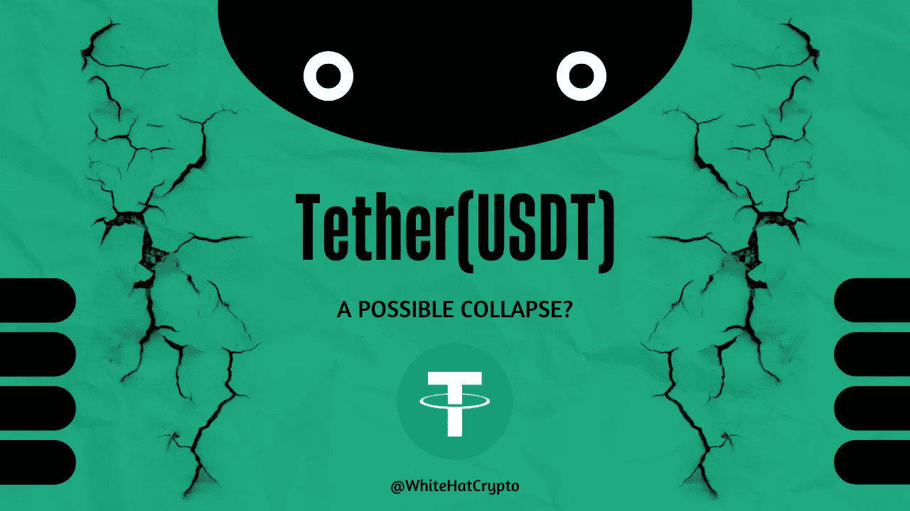

# 系绳要塌了吗？

> 原文：<https://medium.com/coinmonks/is-tether-going-to-collapse-5617b73d22f3?source=collection_archive---------27----------------------->

为什么人们在系绳崩溃上下大赌注？

在 Terra 的 UST 稳定币和 Celsius 网络借贷平台消亡后，全球市值最大的稳定币(USDT)似乎正在打破其与美元的挂钩。

在这两次事件发生后，价格稳定下来，其首席技术官告知投资者，货币将继续允许支付。

承诺以 1:1 的比率将 USDT 等同于美元的 Tether 在 5 月 12 日 UST 崩溃时触及 0.9485 美元的低点。尽管此后一直在 1 美元附近交易，但这种轻微的波动引起了许多人的关注。

本文将讨论这种可能性！

# **UST 的故事:**

Tether (USDT)和 TerraUSD (UST)都是 stablecoins，是与另一种资产或货币(如美元)绑定的加密货币硬币。它们旨在让投资者以数字形式存储资金，而不受比特币(BTC)或以太网(ETH)等加密货币波动的影响。

稳定币持有者可以通过分散金融(DeFi)应用程序使用它们来借贷和赚取利息。

灾难发生前，UST 的市值为 187 亿美元，而 USDT 硬币价值 832.4 亿美元，USDC 硬币价值 535.3 亿美元。

此后，Tether 的价值降至 741.2 亿美元，USDC 仍为 527.8 亿美元，UST 降至 10 亿美元。

# UST 有什么不同？

UST 不同于 USDT 和 USDC，它是一种算法稳定币(一种非抵押的稳定币，使用算法来保持稳定的价值)，而 USDT 和 USDC 是抵押的。

不管价格如何，UST 算法采用了链上交换机制，用 1 UST 换 1 美元的露娜。这是为了鼓励用户在稳定币的价值低于 1 美元时将 UST 换成卢纳，而在稳定币的价格超过 1 美元时将卢纳换成 UST，从而烧掉部分卢纳，降低其流通供应量以维持价格。剩余部分被转移到公司金库。

锚定协议奖励持有人 20%的存款利率，推动了 UST 的成功。另一方面，Terra 用公司的国库资金补贴了 20%的利息。没有用户铸造更多的 UST 和提高月神价格，Terra 将无法支付。

5 月 9 日，投资者开始抛售 UST，以推动其对美元贬值。随着 UST 销量的增加，月神的价格很快下跌，导致了恶性通货膨胀。

UST 的价值在 5 月 12 日跌至 0.7934 美元，此后进一步下跌，在 5 月 19 日跌至 0.07601 美元，而 USD 美元的价格已经稳定。Luna Foundation Guard 购买了比特币，以应对双令牌计划没有抵押的投诉，该公司被迫抛售其持有的比特币，试图稳定 Luna，但没有成功。

# USDT 的故事:

当纽约州司法部长[在 2019 年调查](https://ag.ny.gov/press-release/2019/attorney-general-james-announces-court-order-against-crypto-currency-company)tether token 时，人们怀疑“‘Bitfinex’交易平台的运营商，他们也控制着‘tether’数字货币，犯下了掩盖行为，以掩盖混合客户和企业资金的 8.5 亿美元的明显损失，”并且至少在 2017 年 6 月至 9 月期间，该硬币没有美元持有量的支持。

结果，泰瑟和 Bitfinex 同意支付[1850 万美元](https://ag.ny.gov/press-release/2021/attorney-general-james-ends-virtual-currency-trading-platform-bitfinexs-illegal)的费用来解决分歧。

荷兰盛宝银行(Saxo bank)分析师安德斯·尼斯蒂(Anders Nystee)和马达斯·埃伯哈特(Mads Eberhardt)在 5 月 12 日的一份报告中指出:

> “据报道，最大的稳定货币 Tether 的 85%的储备是现金和现金等价物，其余的是其他资产，如公司债券和其他数字代币。然而，Tether 早些时候在美元储备的透明度方面面临争议，因此市场多年来一直质疑其储备由哪些资产组成，以及 Tether 实际上是否保留了全额储备来支持其稳定的美元。”
> 
> “这些争议可能是驱使稳定的货币投资者远离 USDT 的原因，因为 UST 事件刷新了市场对 Tether 外汇储备缺乏透明度的记忆。USDT 股市今天上午的抛售发生在 Tether 的首席技术官在 Twitter 上发布消息称，他们将继续以 1 美元的价格兑现 USDT 的赎回，并且在过去 24 小时内已经完成了超过 3 亿美元的赎回之后

它接着说，这些情况并不表明失去了联系汇率或储备支持，而是交易所的抛售兴趣超过了它们对硬币的限制性流动性，它说:

> “任何一家交易所的账簿上都不会有足够的流动性来处理每一枚 USDT 币兑换成美元的交易。在交易所流动性过低的情况下，投资者会要求赎回，这正是 5 月份发生的情况。5 月 11 日和 12 日，USDT 的价格在几个交易所偏离了 1 美元的典型价格。这导致投资者在这些交易所以折扣价购买 USDT，然后以 1 比 1 的比例用 Tether 赎回这些 USDT 代币。”

Tether Holdings 于 5 月 19 日提交了季度报告，详细说明了其总储量。统计数据显示，商业票据投资下降了 17%，但购买美国国债的数量有所增加。截至 3 月 31 日，其总资产至少为 824.2 亿美元，维持了其市值。

虽然最近几个月 Tether 的供应明显减少，但 Eberhardt 指出，交易者继续选择 stablecoin 而不是其他类似的加密货币，因为“与同等的 USDC 交易对相比，Tether 中报价的交易对通常更具流动性。”

Tether 的首席技术官 Paolo Ardoino 在推特上表示，Tether 的产品组合比以往任何时候都更加强大。

# 系绳会塌吗？

对冲公司正在押注数亿美元，系绳将贬值，这将是一个彻底的失败！

这可能是因为投资者目睹了 UST 在几个月前完成了同样的事情。许多投资者认为，在一连串不成功的稳定事件中，Tether 将是下一个。

人们一直在怀疑是谁控制着这种货币背后的公司，以及该公司是否真的拥有它声称拥有的股份。旨在支撑货币的资产。

有鉴于此，做空 Tether，或者押注它会崩溃，对一些人来说可能是一个可靠的选择。

但事实是，与没落的 UST 相比，系绳是一种非常不同的数字货币，它在加密生态系统中扮演着至关重要的角色。虽然预测未来是不可能的，但考虑到基本模型，将系绳的功能与 UST 进行比较是不公平的！

这篇文章中提供的内容不是赞助的，据我所知是正确的。这篇文章不是金融建议，我们不对针对这篇文章采取的任何行动负责！

请随时查看我们的社交平台，了解每日加密更新，或通过以下渠道联系我们:

[YouTube](https://www.youtube.com/channel/UCjfinzatswbVaRd89zn5kJQ/featured)

[推特](https://twitter.com/whitehatcrypto)

[Instagram](https://instagram.com/white.hatcrypto?igshid=YmMyMTA2M2Y=)

[Gmail](http://cryptowhitehat@gmail.com)

> 交易新手？尝试[加密交易机器人](/coinmonks/crypto-trading-bot-c2ffce8acb2a)或[复制交易](/coinmonks/top-10-crypto-copy-trading-platforms-for-beginners-d0c37c7d698c)