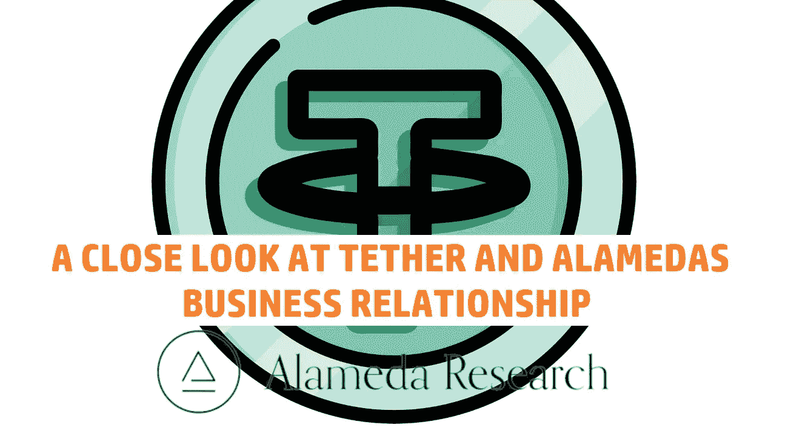
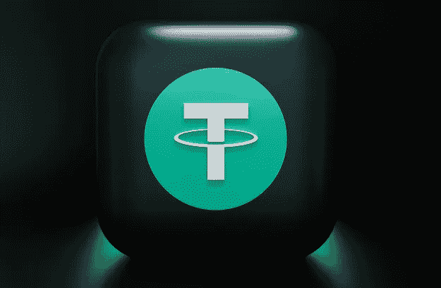
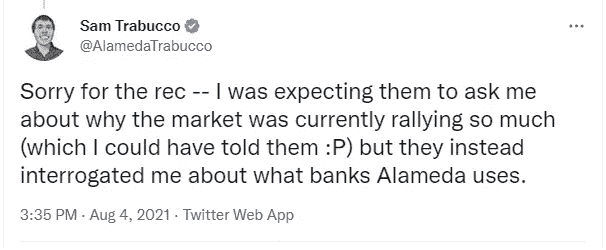

# Tether 的商业模式只是烟幕弹吗？阿拉米达的研究是建立在虚无之上的吗？

> 原文：<https://medium.com/coinmonks/is-tethers-business-model-just-smoke-and-mirrors-was-alameda-research-just-built-on-nothing-b077e641ae73?source=collection_archive---------4----------------------->

在 FTX 崩盘后，有很多事情被揭露和关注。我认为这一次可能已经被大多数人忽略了。我说的是最近发布的一份报告，其中他们调查了谁被发放了系绳。这本身就是一本有趣的读物。但我并没有多想，直到第二块拼图出现。

# 谁得到了所有的系绳

总共发行了 1085 亿美元的系绳。其中，绝大多数都被送到了他们所谓的“做市商”手中。他们的份额高达 969.8 亿美元。在该报告中，术语“做市商”被定义为“从价值 1 亿 USDT 或以上的系留国债获得多项单独交易的实体”

他们接着说，传统上，做市商一词用于描述“从资产差价(买卖订单之间的价格差异)中获利”的实体。由于不清楚加密生态系统中的哪些实体是严格意义上的做市，哪些实体也利用高频交易、自营交易台或运营风险资本基金，因此我们试图在它们之间进行划分(尽管有一个宽泛的定义)”。

当我们看着已经获得最大份额的实体时，有两个远远超过其他实体。这两个是阿拉米达研究和坎伯兰全球。他们分别获得了近 367 亿美元和 237 亿美元。第三大是 iFinex，他们至少收到了 45 亿美元。这意味着它几乎是坎伯兰的 5 倍。

# 有什么问题？

既然我们知道谁拿到了系绳。有什么问题吗？这里我将只关注阿拉米达的研究。这是因为他们和坎伯兰环球有相同类型的模式。我会假设他们以同样的方式做生意。

正如我们从阿拉米达泄露的财务文件中所知，正是这个文件引发了这场危机。我们知道他们几乎资不抵债，虽然他们显示的资产总额为 146 亿美元，但其中大部分要么是贷款，74 亿美元，FTT 代币或其他 sbf 宠物项目的密码。这意味着没有任何真正有价值的东西。没有大块的系绳或其他稳定的线绳，只是坐在那里。事实上，在报告中，我发现根本没有提到任何系绳。也没有大量的美元。

*Reenactment of what was happening at Alameda Research HQ during 2021*

但是如果我们看看系绳报告。阿拉米达收到了近 367 亿美元的资金。而且更奇怪的是，317 亿美元(86%)是在过去一年，2021 年收到的。这让我想到一个问题，这些钱都去了哪里？即使他们所做的只是在 80 美元的峰值价格购买$FTT 代币，这也意味着他们仍然应该有近 210 亿美元的纯$FTT 代币。

如果我们看看比特币，它的价值也从峰值下跌了 70%。与 FTT 币非常相似的数字。但阿拉米达只有 146 亿美元，其中近 80 亿美元是贷款。所以现在的问题是，所有的钱都去了哪里？阿拉米达是否一直在做一些如此低劣的交易，以至于他们的资产价值只有 70 亿美元，而不是 210 亿美元。他们在交易或达成交易方面有那么糟糕吗？请注意，这也是在牛市期间。

# 阿拉米达是怎么拿到系绳的？

这似乎是现在的问题。阿拉米达是怎么拿到系绳的？他们用什么做抵押？因为如果我们相信泰瑟，得到 1 美元 USDT 的唯一方法是给他们 1 美元的现金或“金融辣椒”，一种短期债务。12 月，Tether 得到了 83.74%商业票据的支持。并在 2022 年的大部分时间里试图削减其商业辣椒的持有量。阿拉米达很可能就是用这个来确保他们的系绳支付或交易的安全。

这是阿拉米达前联合首席执行官萨姆·特拉布科在一次采访中被问到这个问题时的回答。当时，SBF 和其他人对 Coindesk 用这个问题伏击 Sam 感到愤怒。现在回想起来。我要说这很说明问题。

*By the looks of things they were more than right to ask*

2021 年 10 月，还证实了 Tether 事实上以比特币作为抵押发放贷款。并且已经这样做了。后来有报道称，当 Celsius 崩溃时，Tether 没有遭受损失，因为当时贷款的超额抵押率高达 130%。这意味着比特币的价值超过了他们借给 Celsius 的额度。

我了解到，Tether 确实提供这类贷款，但其安全性是比特币的 2:1。但我在研究中未能证实这一点。但如果我们使用这个数字或 1.3:1，这将意味着阿拉米达必须拿出 410 亿至 634 亿美元的比特币作为他们收到的所有限制的担保。

嗯，除非他们保留了所有的系绳。也许他们送了一些回来，借了，送回来，等等。说得好，在报告中他们说，由于大多数被送回的系绳都是通过交换被送回的。这使得看清谁在发送什么变得更加困难。80%以上返回的系绳都是通过这种方式发送的。但他们对做市商的划分与最初一样。然后日期显示这个。

*   在 USDT，230 亿美元(62%)以超过 1 亿美元的金额分批返还(做市商)。
*   127 亿美元(34%)在 1000 万美元到 1 亿美元(基金和公司)之间分批送出。
*   15 亿美元(4%)流入美国国债，总额低于 1000 万美元(个人交易者)。

流回 Tether 的量总计 372 亿美元。如果我们忽略这样一个事实，即做市商最有可能以类似于他们恢复贷款的方式偿还贷款。假设阿拉米达修复的份额等于他们发行的份额。那么我们得到 33.8%的偿还额将来自阿拉米达。这给了我们刚刚超过 125 亿美元。剩下的 240 亿美元去了哪里？这肯定不在阿拉米达的资产中，这是肯定的。它也不在 FTS，因为那里有一个 80-100 亿美元的黑洞。即使所有回流的资金都是来自阿拉米达的还款，也只是勉强达到收支平衡。

报告中有一部分可能会给这些数字增加一点不确定性。那就是“尽管 Protos 已经确认了超过 70%的 USDT 已发行债券”。这是在报告末尾的“回归美国国债(资金流入)”部分。我不得不承认，我不确定这是关于所有发放的系绳，还是他们只能识别 70%归还的系绳。

如果是后者，这将意味着归还的系绳总额为 530 亿美元。这将使阿拉米达的份额接近 180 亿美元。这仍然没有描绘阿拉米达或系绳在一个好的光。但我认为这不太可能，因为目前流通的系绳总量为 655 亿美元。

*Ladies and gentlemen, get your Tether snake oil right here, special price just for you. Pay for two and get one.*

但我越来越觉得，泰瑟的商业行为往好里说是有问题的，往坏里说就像一个蛇油推销员。这引发了更多关于阿拉米达研究和 FTX 的问题。那里到底发生了什么事，钱都到哪里去了？

你能比我更明白这一点吗？因为对我来说，这看起来很糟糕。但是我可能做了一些错误的假设。如果你发现任何请让我知道。请在下面的评论区说出你对此的想法。我很想听听你对此的看法。如果你想支持我和我制作的内容，请考虑关注我，阅读我的其他帖子，或者为什么不两者都做。

网络上见！

图片提供:[https://unsplash.com/,](https://unsplash.com/)[https://pixabay.com/](https://pixabay.com/)

资源

1.  [https://protos . com/tether-papers-crypto-stable coin-usdt-investigation-analysis/](https://protos.com/tether-papers-crypto-stablecoin-usdt-investigation-analysis/)
2.  [https://www . coin desk . com/business/2022/11/02/divisions-in-Sam-bankman-frieds-crypto-empire-blur-on-his-trading-titan-alamedas-balance-sheet/](https://www.coindesk.com/business/2022/11/02/divisions-in-sam-bankman-frieds-crypto-empire-blur-on-his-trading-titan-alamedas-balance-sheet/)
3.  [https://decrypt . co/100289/tether-has-reduced-commercial-paper-stable coin-backing-last-6-months-CTO](https://decrypt.co/100289/tether-has-reduced-commercial-paper-stablecoin-backing-last-6-months-cto)

> 交易新手？试试[密码交易机器人](/coinmonks/crypto-trading-bot-c2ffce8acb2a)或[复制交易](/coinmonks/top-10-crypto-copy-trading-platforms-for-beginners-d0c37c7d698c)