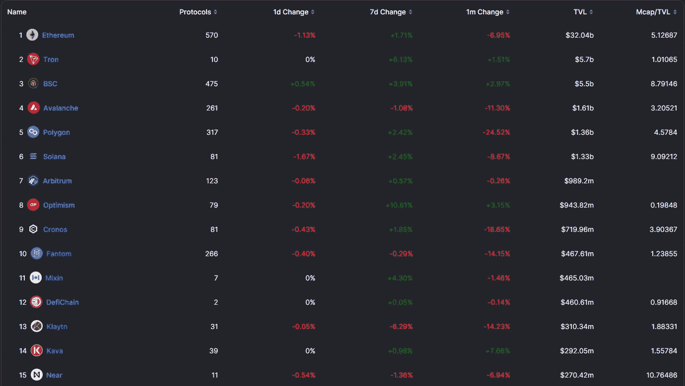
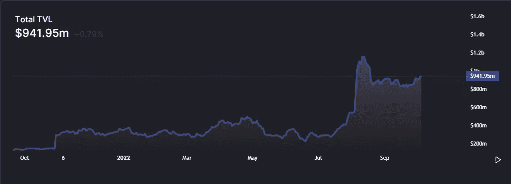
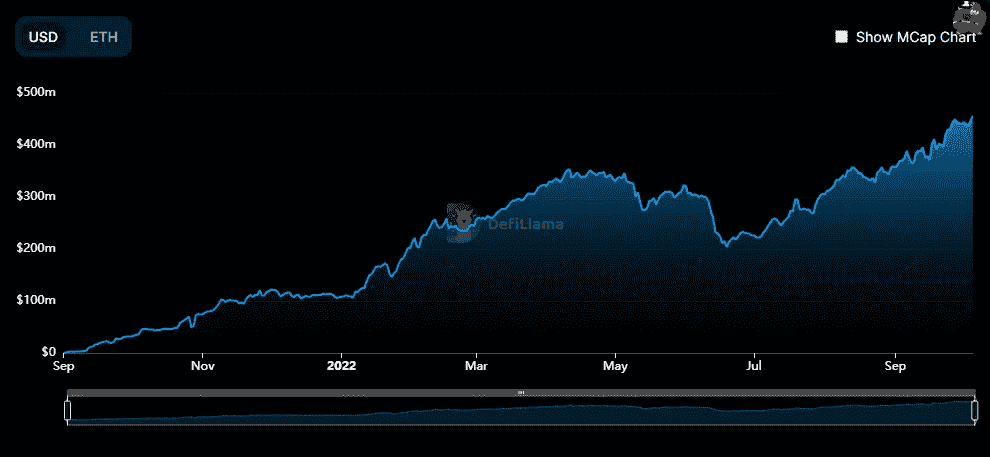
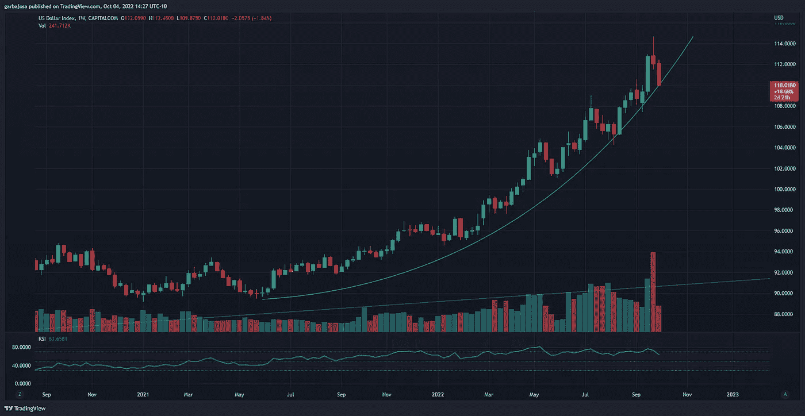
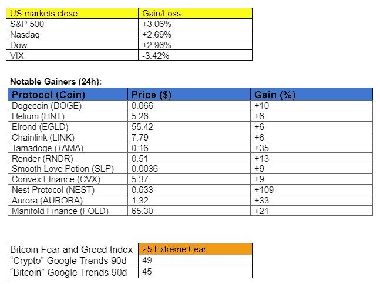

# 熊市接近尾声了吗？

> 原文：<https://medium.com/coinmonks/is-the-bear-market-be-nearing-its-end-f4c739c85ac0?source=collection_archive---------22----------------------->

## 每日征服#097

*The days crypto news、insights 和 alpha。*

Photo by [sebastiaan stam](https://unsplash.com/@sebastiaanstam?utm_source=medium&utm_medium=referral) on [Unsplash](https://unsplash.com?utm_source=medium&utm_medium=referral)

*密码市场是一个狂野、奇妙而令人生畏的地方；不要一个人跋涉！订阅加密征服者，让我们成为您的向导。*

订阅这份每日时事通讯，永不错过任何一期。

**概述**

*   TVL 更新:哪些协议在维持增长？
*   市场:看涨价格行动继续。
*   埃隆马斯克将收购 Twitter。
*   雷伊·达里奥从布里奇沃特辞职。
*   富达向客户提供以太坊支持的指数。

早上好，家人，

虽然进展不错，但我们将探索加密领域的总价值锁定(TVL)格局，看看哪些协议在持续增长，并帮助我们找到一些表现不佳的协议。

**链条顶端 15**

*来源:*[*DeFi Llama*](https://defillama.com/chains)

以太坊保持相对平稳，TVL 市场小幅下跌近 7%。Tron、BSC、Arbitrum 和乐观公司都表现出了实力，尽管 9 月份加密市场相当艰难。另一方面，TVL 的索拉纳、波利贡和雪崩都经历了相当大的下降。渐渐地，以太坊 L2 仲裁和乐观主义继续从去年夏天开始在表现最佳的 L1 上取得进展(Solana，Avalanche)。

**乐观**

*来源:*[*DeFi Llama*](https://defillama.com/chain/Optimism)

我关注乐观主义已经很长时间了，它的 TVL 图表继续攀升，而其他许多人都接近他们的低点。在 AAVE、Uniswap 和 Curve 等备受信任的协议的跨链过渡的帮助下，一些 DeFi 用户正在过渡到 L2，以节省以太坊更高的燃气费。乐观主义也提供了许多通过激励池在网络上交易的动机。除了一些 OP 奖励之外，这些池还赚取典型的收益。

**仲裁法庭上的 GMX**

*来源:*[*DeFi Llama*](https://defillama.com/protocol/gmx?denomination=USD)

关于 TVL，加密中最热门的协议之一继续增长。GMX 网络在 TVL 上涨了+30.25%，因为交易员涌入 DeFi 2.0 网络交易杠杆化的 ETH 和 AVAX。押注 GMX 还有一个额外的好处，那就是在 ETH 中赚取收益，增加代币的效用。通常，随着令牌效用的增加，需求也会增加。

**展示 TVL 持续增长的其他方案:**

*   [**【火箭池】【RPL】**](https://defillama.com/protocol/rocket-pool?denomination=ETH)**:以太坊跑马场。**
*   [**【欧拉金融(EUL)**](https://defillama.com/protocol/euler?denomination=ETH) **:无权限借贷。**
*   [**Ref Finance(Ref)**](https://defillama.com/protocol/ref-finance?denomination=NEAR)**:DEX on Near。**

# 市场更新🌍

BTC/USDT·1D

始于 2021 年 11 月初的下降趋势会结束吗？经过两天的看涨价格行动，BTC 似乎已经打破了明显的下降趋势阻力。在宏观经济从这里开始改善之前，价格格局更有可能保持区间波动。BTC 收盘上涨 3.61%，至 20，337 美元。

*高分辨率* [***图表***](https://www.tradingview.com/x/EvZtcJSa/)

**DXY/USD 1W**

本周所有图表都在测试支撑位和阻力位。我们的最爱？美元指数(DXY)在本周下跌 1.83%后，正在测试周图上成交量增加背后的长期抛物线支撑。如果美元对其他货币继续下跌，预计股票和加密开始复苏。

*高分辨率* [***图表***](https://www.tradingview.com/x/IlyKpntB/)

如果你喜欢这份报告，并且认为它值 20 分(0.01 美分)，请按下面的鼓掌按钮来支持我的写作。(最多 50 次！)谢谢！

# 新闻观察📰

**埃隆·马斯克收购 Twitter。在退出收购 Twitter 和[以每股 52.20 美元的价格出价 440 亿美元收购这家社交媒体平台后，马斯克结束了这场法律战。在新闻网宣布马斯克给该公司写了一封信并向证券交易委员会(SEC)提交了一份动议后，Twitter 的股票上涨了 20%以上。](https://twitter.com/business/status/1577331947147247617?s=20&t=X1L1k6cF2UDivTzy5mn79g)**

有传言称，马斯克打算通过微交易将 DOGE 作为网络上的主要支付手段来发布推文，但这一消息尚未得到证实。结果，DOGE 股价昨日上涨了 9%。

**富达开始推出以太坊指数基金。**该投资公司自 9 月份以来已经筹集了 500 万美元，并向合格投资者提供以太网(ETH)风险敞口。

**万事达卡推出加密反欺诈工具。**金融信贷公司准备[发布](https://twitter.com/Ryan_Browne_/status/1577163287414050816?s=20&t=X1L1k6cF2UDivTzy5mn79g)一款基于人工智能的软件解决方案，帮助发卡机构和银行打击与密码相关的欺诈。加密安全程序提供了一个仪表板，详细列出了加密交易欺诈的可疑程度，允许发卡机构进行干预。

雷伊·达里奥辞职。投资者雷伊·达里奥辞去了全球最大对冲基金 Bridgewater Associates 的总裁一职，并赋予该公司董事会成员投票权。达利奥在 47 年前创立了这家公司。

**新闻花絮:**

*   Bit.com[推出](https://blog.bit.com/bit-com-ahead-of-the-curve-with-new-usd-crypto-options-trading/)美元加密期权交易。
*   摄氏[设定资产拍卖的](https://www.theblock.co/post/174603/celsius-sets-dates-for-asset-auction-following-bankruptcy?utm_source=telegram1&utm_medium=social)日期。SBF 正在考虑申办。
*   丝带金融[推出](https://twitter.com/ribbonfinance/status/1576967468295213058?s=20&t=9gr1WusDh2nZR0ymEJ3P_A)丝带贷款。
*   加州 95 亿美元的天然气退款将于本月发往 T21。

**NFT &元宇宙更新🐵**

*   位于以太坊的 NFT 项目 VeeFriends 将在梅西百货和玩具反斗城等零售店发布玩具。
*   雨果博斯[与 NFT 项目假想者](https://www.theblock.co/post/174617/hugo-boss-to-launch-nft-and-360-degree-metaverse-experience-with-imaginary-ones?utm_source=telegram1&utm_medium=social)联手推出元宇宙。
*   随着 Moonbirds DAO 的创建，Moonbirds [将](https://decrypt.co/111147/moonbirds-dao-2-6m-thereum-nfts-kevin-rose-proof)转变为社区主导的治理模式。

**我的五分钱……**

技术分析和一些基本面催化剂的结合描绘了一幅充满希望的市场图景。结果是仅仅是一次宽慰的反弹，还是熊市的终结，还有待观察。

**基本面催化剂**

美联储已经开始感受到放松加息的压力。昨天，联合国发布了一份报告，要求做到这一点。此外，距离美国中期选举还有 35 天，总统和民主党希望市场在选民投票前看起来不错。

定于 10 月 13 日发布的 CPI 数据将让人们了解杰罗姆·鲍威尔(Jerome Powell)和他的团队决定做什么。如果 CPI 奇迹般地大幅下降，我不会感到惊讶，但那只是一种乐观的看法。但随着美联储与政治联系如此紧密，这些相关性成了共同点。

**关注我* [*推特*](https://twitter.com/web3_gabri) *每日更新！**

*订阅这份每日时事通讯，不要错过任何一期。*

> *交易新手？尝试[加密交易机器人](/coinmonks/crypto-trading-bot-c2ffce8acb2a)或[复制交易](/coinmonks/top-10-crypto-copy-trading-platforms-for-beginners-d0c37c7d698c)*