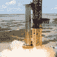
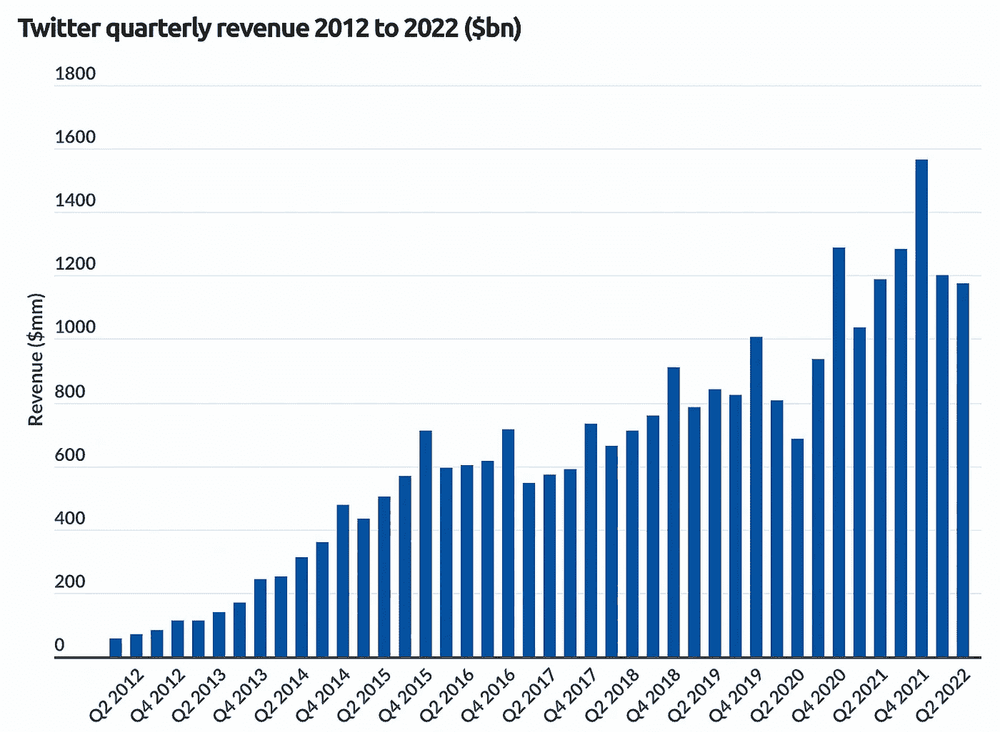
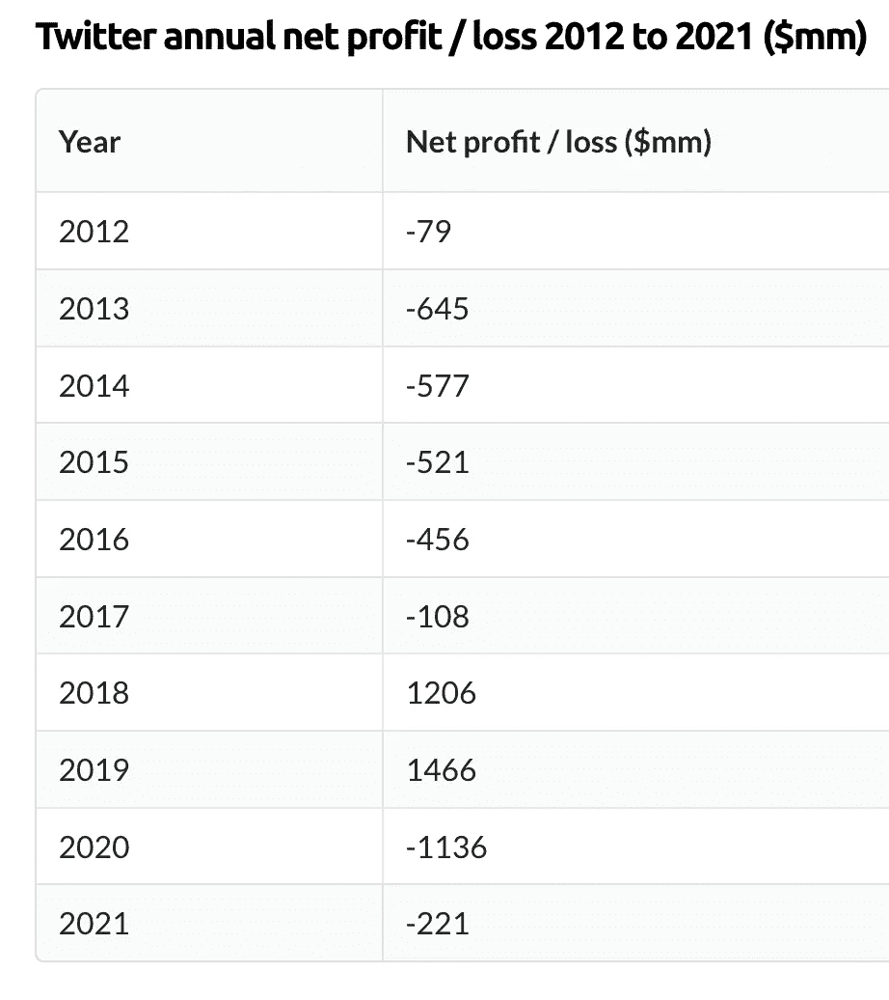
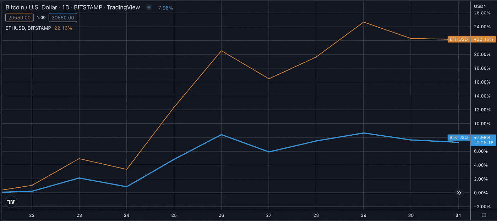
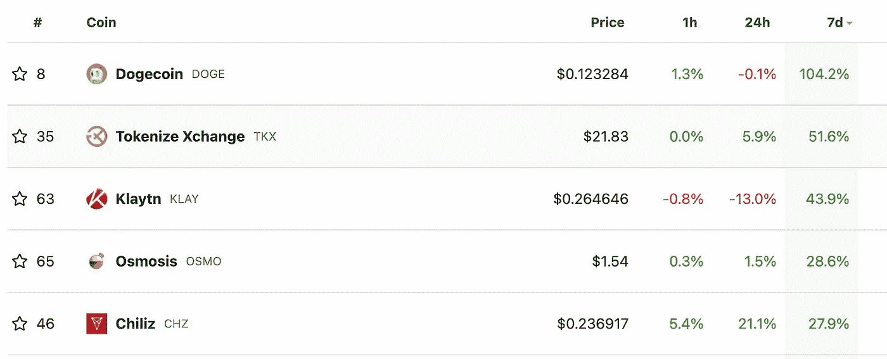

# 这只鸟是自由的吗？

> 原文：<https://medium.com/coinmonks/is-the-bird-free-800e2ee03461?source=collection_archive---------47----------------------->

# 内容(4 分钟阅读):

*   🐦这只鸟是自由的吗？
*   📉**风投受到加密价格下跌的打击**
*   📈BTC 和瑞士联邦理工学院正在行动
*   💰本周硬币
*   📰热门阅读
*   🙏🏻感激…

# 🐦这只鸟是自由的吗？

[埃隆马斯克@埃隆马斯克](https://twitter.com/elonmusk/status/1585841080431321088)

[小鸟被释放了](https://twitter.com/elonmusk/status/1585841080431321088)

[https://twitter.com/elonmusk/status/1585841080431321088](https://twitter.com/elonmusk/status/1585841080431321088)

这只鸟没有完全自由，但是笼子变大了。在本周埃隆·马斯克将公司私有化后，关于 Twitter 的未来有很多争议。一些人认为这将使 Twitter 变得更加开放和透明，而另一些人认为这将使这个平台更加排外和难以进入。

一家私人所有的公司不可能完全自由，因为影响所有用户的每一个决定都是由一小群人在考虑他们的利益时做出的。一个更分散的组织，如 DAO 结构，可以允许它以更自由的形式运作，特别是拥有一个多元化的团队，对用户的反馈持开放态度，以创建一个开放的社交媒体平台，激励所有用户发表健康的言论。

订阅

# Twitter 关键统计数据

*   Twitter 在 2021 年创造了 50 亿美元的收入，同比增长 35%
*   2021 年 Twitter 92%的收入来自广告
*   Twitter 公布 2021 年净亏损 2.21 亿美元，比 2020 年 11 亿美元的亏损减少了 80%
*   Twitter 在美国拥有 2.06 亿日活跃用户和 3800 万用户

来源:应用商业

在收购后，Twitter 已经失去了通用汽车作为广告客户，其他一些公司选择退出，袖手旁观，监测即将到来的变化。**Twitter 会成为特斯拉和 SpaceX 的扩音器吗？埃隆能够解决促使他购买机器人的问题吗？Twitter 能够扭亏为盈吗？**

应用程序业务

有很多问题，毫无疑问，埃隆有着令人印象深刻的记录，但经营一家媒体公司是另一回事。

另一方面，美国中期选举将于 11 月 8 日举行。正如我们所知，许多用户和政治家因使用仇恨言论和试图操纵选举而被禁止使用 Twitter。我们将会看到这只鸟的变化是否足够快，是否会在即将到来的选举中产生更直接的影响，以及是否有任何被禁止的用户被邀请回来。我们将继续关注这次收购。

# 📉密码价格下跌打击了风投

熊市让一些业内最大的风险投资公司付出了代价。潘迪拉资本是一家著名的秘密风险投资公司，这一年过得很糟糕。据 Block 获得的一份投资者演示文稿显示，截至 9 月底，潘迪拉早期的 token fund 价值下跌了 71%。

这一消息传出之际，由于宏观市场情绪低迷，许多代币和加密货币下跌了 50%以上。不仅仅是潘迪拉。据《华尔街日报》报道，最大的加密投资者之一安德森·霍洛维茨(Andresen Horowitz)的旗舰加密基金价值[下跌了](https://www.theblock.co/post/179956/a16z-flagship-crypto-fund-dropped-value-wsj)40%。

感谢您阅读 Yaro on Tech、Blockchain 和 Web3。这篇文章是公开的，所以请随意分享。

[分享](https://yarocelis.substack.com/p/is-the-bird-free?utm_source=substack&utm_medium=email&utm_content=share&action=share&token=eyJ1c2VyX2lkIjo4NzI4NzQyLCJwb3N0X2lkIjo4MTYyNjMxNSwiaWF0IjoxNjY3MTgxMDU4LCJleHAiOjE2Njk3NzMwNTgsImlzcyI6InB1Yi0yODIwMjIiLCJzdWIiOiJwb3N0LXJlYWN0aW9uIn0.Z4U_yXuuj0I-GChLJcJMLGtsFwBPQT6WUoZ9323KyXY)

# 📈BTC 和瑞士联邦理工学院正在行动

*   比特币交易价格为 20，666 美元，以太网上涨 15%，至 1，537 美元。
*   周三，全球加密市值再次超过 1 万亿美元。

tradingview.com

以太飙升 14%，比特币自 10 月初以来首次回升至 20，000 美元以上，原因是加密市场因美联储进一步大幅加息的预期消退而上涨。

根据比特币基地的[数据](https://www.coinbase.com/price/ethereum)，以太币的涨幅更为明显，以太币上涨 14.9%，至 1537 美元。自从[合并](https://www.theblock.co/post/166708/the-merge-everything-you-need-to-know-about-ethereums-big-upgrade)以来，乙醚的交易价格从未超过 1500 美元。

一些投机者将价格上涨归因于美联储加息预期的缓解和美元的疲软。预计美联储下周将加息 75 个基点，将目标利率从 3%至 3.25%上调至 3.75%至 4%。

与此同时，[美元指数](https://www.tradingview.com/chart/?symbol=TVC%3ADXY)——衡量美元相对于一篮子外国货币的价值——交易在 110 左右，为 10 月 5 日以来的最低水平。随着美元走软，比特币的美元价格自然会上涨。

据 Block 的数据仪表板显示，[周三，全球加密市场市值回到 1 万亿美元以上，在过去三个月里一直努力保持这一地位。](https://www.theblockcrypto.com/data/crypto-markets/prices/crypto-total-marketcap)

# 💰本周硬币

在 [**埃隆马斯克**](https://twitter.com/elonmusk) **完成对 Twitter 的收购后，**的硬币价格已经翻了一番。**众所周知，马斯克在推特上宣传 [Dogecoin](http://ycobitcoin.com/) ，并认为这是他最喜欢的密码之一。Dogecoin 爱好者认为，收购社交平台的举动可能有利于 dogecoin 的未来。**

[分享](https://yarocelis.substack.com/p/will-defi-be-regulated?utm_source=substack&utm_medium=email&utm_content=share&action=share&token=eyJ1c2VyX2lkIjo4NzI4NzQyLCJwb3N0X2lkIjo4MDA4MzMzNywiaWF0IjoxNjY3MTc0NDI5LCJleHAiOjE2Njk3NjY0MjksImlzcyI6InB1Yi0yODIwMjIiLCJzdWIiOiJwb3N0LXJlYWN0aW9uIn0.C81cUJ8Y1qum-eXUC33tUVOk_UChL_PElDd80H9571w)

# 📰热门阅读

*   [比特币价格在 21000 美元下方挣扎，多头会再次发力吗？](https://www.newsbtc.com/news/bitcoin-price-struggles-under-21000-will-the-bulls-power-through-again/)
*   [以太坊创始人维塔利克·布特林:密码行业不应“狂热追逐机构资本”](https://decrypt.co/113168/ethereum-founder-vitalik-buterin-crypto-industry-shouldnt-be-enthusiastically-pursuing-institutional-capital)
*   [概括地说:一周回顾](https://bitcoinist.com/nfts-in-a-nutshell-a-weekly-review-73/)
*   [Chain port 如何让 DeFi 交叉链桥更安全](https://bitcoinist.com/making-defi-cross-chain-bridges-safer/)
*   [尽管 AVAX 看好 TVL，但雪崩投资者完全有理由担心](https://ambcrypto.com/avalanche-investors-have-every-reason-to-be-worried-despite-avaxs-bullish-tvl/)
*   北欧的加密现状:敌对的斯堪的纳维亚和活跃的波罗的海国家
*   [随着大公司面临裁员，技术人才向 Web3 迁移](https://cointelegraph.com/news/tech-talent-migrates-to-web3-as-large-companies-face-layoffs)

> **交易新手？试试** [**密码交易机器人**](/coinmonks/crypto-trading-bot-c2ffce8acb2a) **或** [**复制交易**](/coinmonks/top-10-crypto-copy-trading-platforms-for-beginners-d0c37c7d698c)