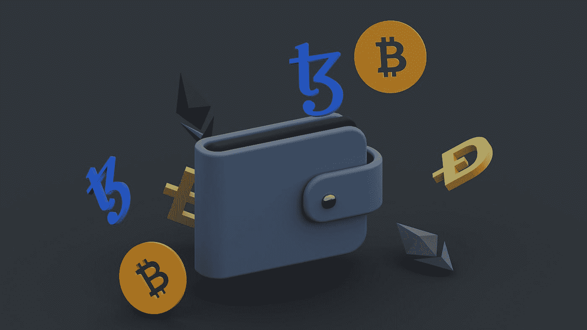

# 加密市场正在经历另一次崩溃吗？

> 原文：<https://medium.com/coinmonks/is-the-crypto-market-experiencing-another-crash-2183eabc81d1?source=collection_archive---------21----------------------->

Photo by [Traxer](https://unsplash.com/@traxer?utm_source=medium&utm_medium=referral) on [Unsplash](https://unsplash.com?utm_source=medium&utm_medium=referral)

加密市场在 2022 年经历了最严重的崩溃，因此称 2022 年为崩溃之年是合理的。

根据 CoinGecko 的数据，FTT 已经从 22 美元跌到了 2 美元，损失了 99%的价值。这是 2021 年 9 月 84 美元历史高点的最低水平。

现在估计这一事件造成的损害程度还为时过早，这一事件的形式是币安收购加密货币和数字资产的主要交易平台之一 FTX.com。然而，市场近期对这一消息反应强烈。这场大屠杀导致过去 24 小时内总市值损失超过 11%，使全球加密市值达到约 9060 亿美元。

> **参见:** [**在加密熊市中赚钱的其他方法。**](/coinmonks/other-ways-to-make-money-in-a-crypto-bear-market-4832bd276176)

# **目前密码市场的状况**

Photo by [Jonathan Borba](https://unsplash.com/@jonathanborba?utm_source=medium&utm_medium=referral) on [Unsplash](https://unsplash.com?utm_source=medium&utm_medium=referral)

*宣布收购*[***【FTX】***](https://www.bing.com/search?q=ftx+exchange&cvid=0a102f922cf94be59753666acebeec9e&aqs=edge.3.69i57j0l8.4565j0j1&pglt=41&FORM=ANNTA1&PC=U531)在 FTX 请求我们的帮助后，为了帮助解决流动性问题，联合创始人兼首席执行官赵昌鹏证实。**

**“存在严重的流动性危机。为了保护用户，我们签署了一份非约束性的 LOI，意在整体收购 FTX.com，并帮助缓解流动性危机。在接下来的几天里，我们将进行一次彻底的 DD，”他继续说道。**

**尽管 CZ 希望减轻币安 FTT 抛售的影响，但该协议成功地使整个加密货币市场陷入亏损。双方没有披露他们协议的财务条款。**

**例如，我们还没有确定 FTX 和班克曼弗里德最近购买的资产会发生什么。很有可能币安不会购买 FTX，因为它的金融历史非常糟糕。数百万投资者仍然对 FTX 流动性危机的消息感到震惊，因为他们中的大多数人从来没有看到它的到来。**

> ****另见:** [**短期买入的前 3 种加密货币**](/web3-surfers/top-3-cryptocurrencies-to-buy-for-the-short-term-68182977f045)**

# ****比特币基地和北海巨妖都经历过断电。****

****

**Photo by [PiggyBank](https://unsplash.com/@piggybank?utm_source=medium&utm_medium=referral) on [Unsplash](https://unsplash.com?utm_source=medium&utm_medium=referral)**

**无论是*还是 [***北海巨妖***](https://www.kraken.com/) 平台，也都在市场动荡中经历了退出停顿。据 Twitter 上的用户称，这一消息是在币安加密交易所宣布有意收购 FTX 之后发布的。***

**用户抱怨连接到该平台的困难，以及关于提现被停止的未经证实的说法。**

**然而，比特币基地从他们的官方账户发推文说，“Coinbase.com，比特币基地专业版和比特币基地 Prime 存在网络连接问题，用户很难登录。”如果您已经登录，您可能会遇到网络和移动应用程序加载延迟的问题，”指出该问题是由于平台上新用户的涌入。**

**北海巨妖方面没有给出官方回应。**

> ****另见:** [**4 款 Cryptos 定于 2022 年第四季度收获丰厚回报**](/coinmonks/4-cryptos-set-to-reap-massive-return-in-q4-2022-79bf74231706)**

# ****用户要求提供预订证明****

****

**Photo by [Shubham Dhage](https://unsplash.com/@theshubhamdhage?utm_source=medium&utm_medium=referral) on [Unsplash](https://unsplash.com?utm_source=medium&utm_medium=referral)**

**为了确保托管人(如中央加密交易所)拥有其声称拥有的资金，可以由独立的第三方审计员进行准备金证明(PoR)。**

**大多数 CeFi 加密平台，包括集中交易所、贷款人和托管人，目前都使用私有的专有数据库来保存资产信息。他们可以自信地声称他们用户的钱在他们那里是安全的，但这种说法很难得到证实。**

**储备证明允许公正的第三方审计(PoR)根据服务条款核实托管人的资产。**

**交易达成数小时后，币安首席执行官赵昌鹏在 Twitter 上宣布，该交易所将开始实施储量证明。加密货币领域的许多知名人士都公开表示支持将准备金证明作为增加流动性透明度的一种手段。**

# **对于加密投资者来说，年底将是艰难的一年**

**尽管我们已经快到年底了，但许多投资者仍持悲观态度。恐惧指数创下历史新高，表明随着 2022 年的结束，加密货币投资者将面临汹涌的波涛。**

**币安是最大的加密货币和数字资产交易平台之一，现在判断该公司对 FTX.com 的拟议收购造成了多大伤害还为时过早。**

**市场对这一消息反应强烈，但只是在短期内。超过 1110 亿美元，即 11%的市值在过去 24 小时内被抹去，使所有加密货币的总市值降至约 9060 亿美元。**

> **交易新手？试试[加密交易机器人](/coinmonks/crypto-trading-bot-c2ffce8acb2a)或者[复制交易](/coinmonks/top-10-crypto-copy-trading-platforms-for-beginners-d0c37c7d698c)**