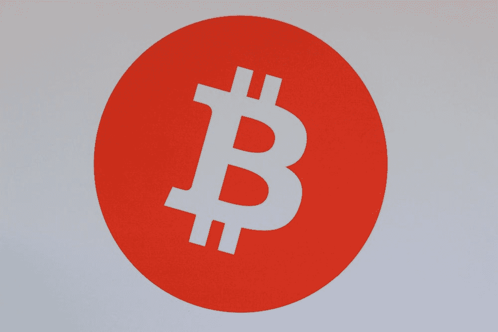

# 政府介入比特币了吗？

> 原文：<https://medium.com/coinmonks/is-the-government-involved-in-bitcoin-fe0b52877b9?source=collection_archive---------24----------------------->

这是最近很多人都在问的问题。随着比特币最近人气的上升，一些人想知道政府是否以某种方式参与了这种数字货币。

这个问题的答案有点复杂。虽然政府没有直接参与比特币，但他们确实有一些间接的参与。例如，政府监管交易所…