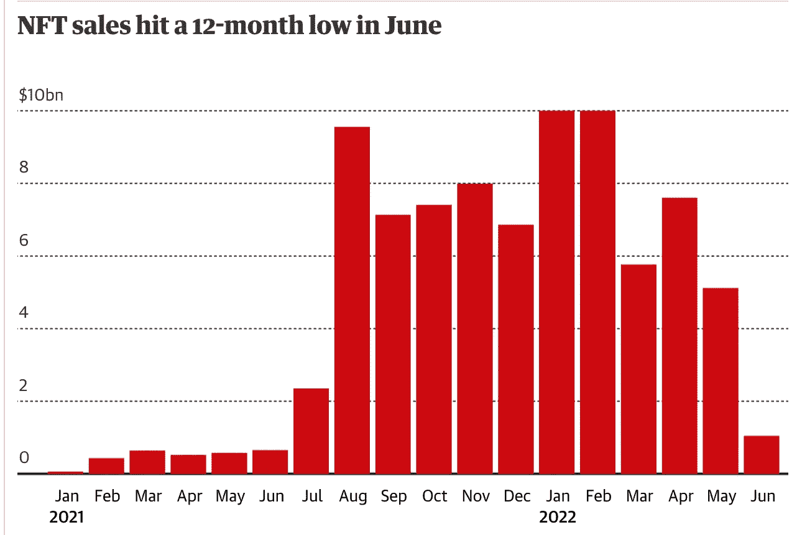

# NFT 销量下滑是因祸得福吗？— Derev 博客

> 原文：<https://medium.com/coinmonks/is-the-nft-sales-slump-a-blessing-in-disguise-derev-blog-50c96aad6df1?source=collection_archive---------14----------------------->

在这次熊市中，NFT 的销售受到了重创。

总的来说，销售额处于一年来的最低点。

不仅整体销售额下降，而且一些最大系列的底价已经跌至他们有一段时间没有见过的低点。