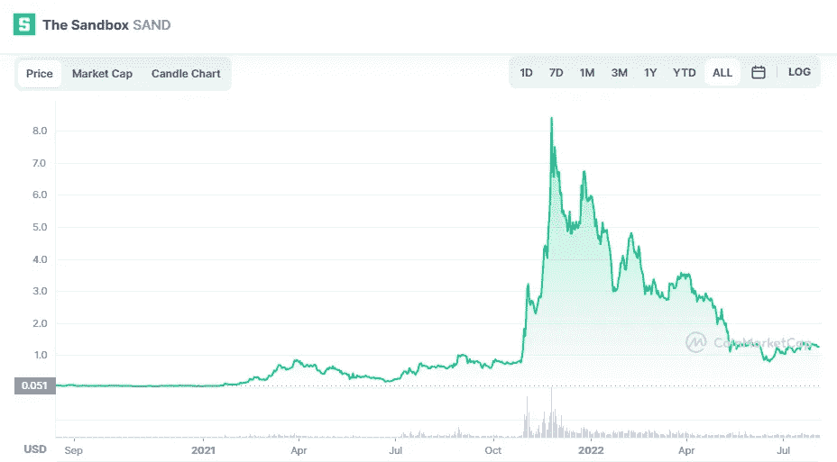

# 沙箱(沙子)是好的投资吗？

> 原文：<https://medium.com/coinmonks/is-the-sandbox-sand-a-good-investment-197d2e0503ee?source=collection_archive---------24----------------------->

Source photo Unsplash.com

使用沙盒可以模拟元宇宙内部的真实世界活动。在这个时间点上，该品牌能够从与雅达利等主要游戏企业的合作中获利。利用沙元宇宙代币的代币生成和交易占据了市场活动的重要部分。在撰写本文时，已经使用了超过 1.23%的 SAND token 供应。