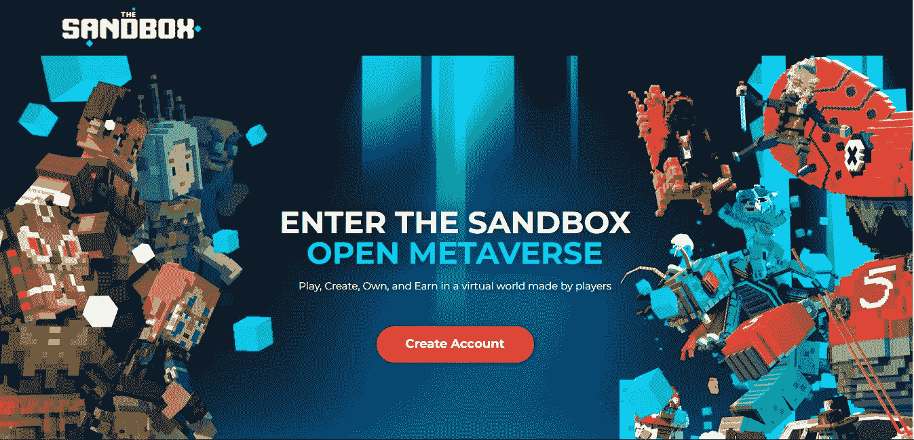

# 沙箱(沙子)是好的投资吗？

> 原文：<https://medium.com/coinmonks/is-the-sandbox-sand-a-good-investment-6b56cf2e8bca?source=collection_archive---------7----------------------->

Source photo [The Sandbox Game — User-Generated Crypto & Blockchain Games](https://www.sandbox.game/en/)

沙盒的功能相当于一个基于区块链的数字游乐场。这也是一款基于区块链的在线赚钱游戏。由于它的目标是将虚拟世界的刺激与玩赚游戏模式的被动收入产生特征相结合，术语“区块链游戏元宇宙”已被用来描述它。