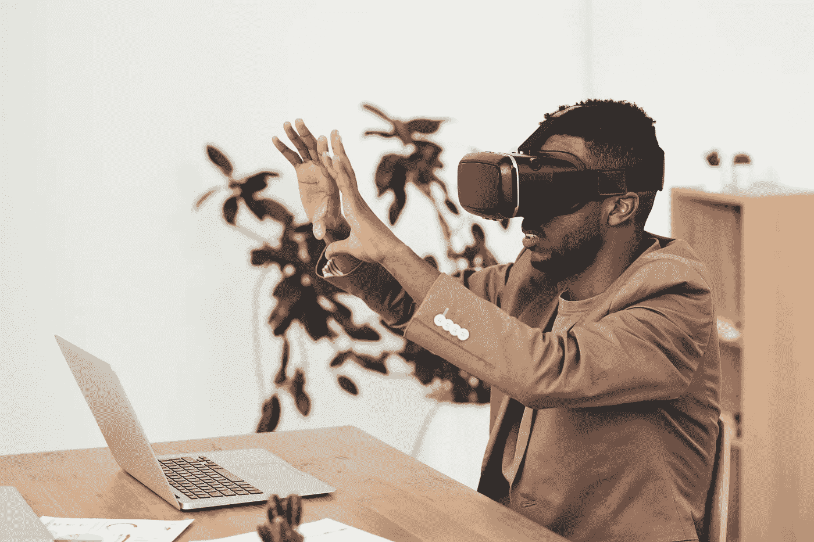

# 是去元宇宙的时候了吗？

> 原文：<https://medium.com/coinmonks/is-the-time-for-metaverse-5dd067961563?source=collection_archive---------23----------------------->

Source photo [Man Using VR Goggles · Free Stock Photo (pexels.com)](https://www.pexels.com/photo/man-using-vr-goggles-3183187/)

几十年来，元宇宙的概念，或者说是一个完全身临其境并与现实世界无缝集成的虚拟世界，一直是一个令人着迷的话题。从科幻小说到流行的视频游戏，虚拟世界像我们自己的世界一样充满活力和真实的想法已经抓住了许多人的想象力。但是元宇宙的时代终于到来了吗？

> 从顶部复制交易机器人…